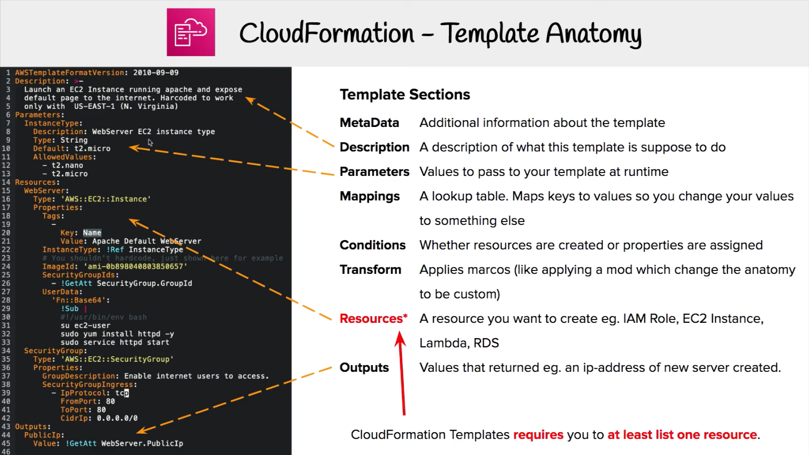
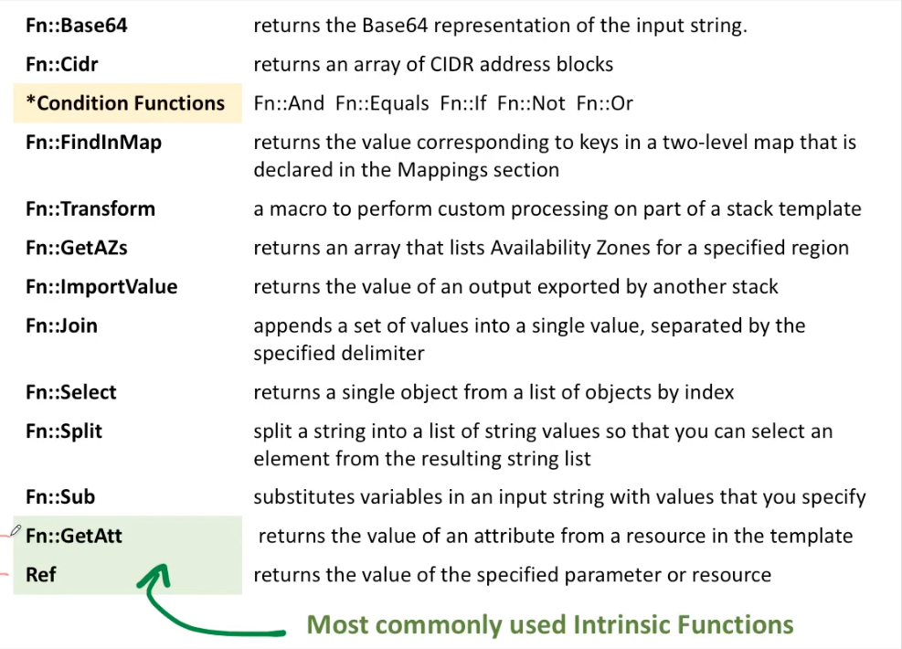

## CloudFormation
Templates have to be uploaded into S3 and then referenced in CloudFormation.
Stacks are identified by the name. Cannot be edited - versioning.
Deleting a Stack deletes every single artifact that was created by CloudFormation!

Deploying templates:
1. Manual way - editing templates in CL designer and using console to input parameters etc.
2. Automated way - editing templates in YAML files, using the CLI to deploy templates.

Building Blocks:
* resources [mandatory element] (AWS components
* parameters (the dynamic inputs for the template)
* mappings (static variables)
* outputs (references to what has been created)
* conditionals (list of conditions to perform resource creations)
* metadata

Template helpers:
* references
* functions (transform data in template)

Stack template:
```
---
Resources:
  MyInstance:
    Type: AWS::EC2::Instance
    Properties:
      AvailabilityZone: us-east-1a
      ImageID: ami-a4c7edb2
      InstanceType: t2.micro
```



Change set preview - information about stack resources change during update.

Resources identifiers:
```
AWS::service-name::data-type-name
```

[AWS resource and property types reference - AWS CloudFormation](https://docs.aws.amazon.com/AWSCloudFormation/latest/UserGuide/aws-template-resource-type-ref.html)

[AWS QuickStarts](https://github.com/aws-quickstart)

Update requires:
* Replacement - new resource will be created
* No interruption - any changes to existing resource

### Parameters
Way to provide  inputs to CF templates. Used when you won’t have to re-upload a template to change its content.

```
Parameters:
  SecurityGroupDescription:
    Description: Security Group Description (Simple parameter)
    Type: String
```

Parameters:
 * Type:
	* String
	* Number
	* CommaDelimitedList
	* List<Type>
	* AWS Parameter (to help catch invalid values)
* Description
* Constrains
* ConstraintDescription (String)
* Min/MaxLength (for string)
* Min/MaxValue (for numbers)
* Defaults
* AllowedValues (array) to restrict the number of values
* AllowedPattern (regexp) verify the user input
* NoEcho (boolean)

### Reference
Used for reference resources and parameters
Parameters => returns the value of parameter
Resources => returns the physical ID of underlying resource (EC2 ID)

Fn::Ref == !Ref

```
DbSubnet1:
  Type: AWS::EC2::Subnet
  Properties:
    VpcId: !MyVPC
```

#### PseudoParameters:
AWS::AccountId		1234567890
AWS::Region 		us-east-2
AWS::StackName		MyStack

### Mappings
Fixed variables (hardcoded) in template.
Used for differentiate between different environments (dev, prod), regions, AMI types etc. - when you know in advance all values that can be taken.

```
Mappings:
  RegionMap:
    us-east-1:
      "32": "ami-5464df4g"
      "64": "ami-5564df6g"
    us-west-1:
      "32": "ami-6264df4g"
      "64": "ami-3454df6g"
```

Fn::FindInMap == !FindInMap [MapName, TopLevelKey, SecondLevelKey]

`ImageID: !FindInMap [RegionMap, !Ref "AWS::Region", 32]`


### Outputs
Optional outputs values that can be imported/exported.
Network CF template outputs variable as VPC ID, Subnet ID to use in another template.

Can be accessed from AWS Console or CLI. Stack cannot be deleted if its outputs are referenced in another stack.

```
Outputs:
  StackSSHSecurityGroup:
    Description: The SSH Security Group for many projects
    Value: !Ref MyCompanyWideSSHSecurityGroup
    Export:
      Name: SSHSecurityGroup
```

### Cross Stack Reference
Fn::ImportValue == !ImportValue

```
Resources:
  MySecureInstance:
    Type: AWS::EC2::Instance
    Properties:
      AvailabilityZone: us-east-1
      ImageId: ami-a4c7edb2
      InstanceType: t2.micro
      SecurityGroups:
        - !ImportValue: SSHSecurityGroup
```

### Conditions
Used to control the creation of resources or outputs based on a condition.

Each condition can reference another condition, parameter value or mapping. Conditions can be applied to resources/outputs/ etc.

```
Conditions:
  CreateProdResources: !Equals [!Ref EnvType, prod]
```

Logical functions:
* Fn::And
* Fn::Equals
* Fn::If
* Fn::Not
* Fn:: Or

Conditions can be applied to resources/outputs/ etc.
```
Resources:
  MountPoint:
    Type: "AWS::EC2::VolumeAttachment"
    Condition: CreateProdResources
```

### Intrisic Functions (Wewnętrzne funkcje)
Assign values to properties that are not available until runtime.

1. Fn::GetAtt
Used to get information about resource, eg. AZ, PrivateIP for given EC2
```
~ AWS::EC2::Volume declaration
...
		AvailabilityZone:
  			!GetAtt MyEC2Instance.AvailabilityZone
```

2. Fn::Join
Join values with a delimiter.
!Join [delimiter, [comma-delimited list of values] ]
```
!Join [":", [a,b,c]]
this creates:
"a:b:c"
```

3. Fn::Sub
Used to substitute variables from text. String must contain ${VariableName}.
[need more info]

4. !Select

```
# Select first available AZ from given region
AvailabilityZones:
  - !Select
    - 0
    - Fn::GetAZs: !Ref 'AWS::Region'
```

Others:


### UserData in EC2
Entire script must be passed through the function using Fn::Base64.
UserData script log: /var/log/cloud-init-output.log

```
Resources:
  MyInstance:
    Type: AWS::EC2::Instance
    Properties:
    ...
    UserData:
      Fn::Base64: |		# pipe is used for multi-line string
        #!/bin/bash -xe
        yum update -y
        yum install -y httpd
        systemctl start httpd
        systemctl enable httpd
        echo "Hello world" > /var/www/html/index.html
```


### cfn-init
Send UserData from external resource - special format of writing scripts (like Ansible modules)., not in Bash.  EC2 instance is querying CloudFormation service for cfn-init script.

AWS::CloudFormation::Init must be in metadata of resource.
Logs are available in `/var/log/cfn-init.log`

```
Resources:
  MyInstance:
    Type: AWS::EC2::Instance
    Properties:
    ...
    UserData:
      Fn::Base64:
        !Sub |		# pipe is used for multi-line string
        #!/bin/bash -xe
        # Get the latest CloudFormation package
        yum update -y aws-cfn-bootstrap
        # Start cfn-init
		  /opt/aws/bin/cfn-init -s ${AWS:StackId} -r MyInstance    		  --region ${AWS::Region} ||
        error_exit 'Failed to run cfn-init'
```

Metadata - see code #4 from materials.

### cfn-signal & WaitCondition

Script tells CloudFormation if cfn-init script succeeded or not. This can be used for completing or cancelling template creation.

Run cfn-signal right after cfn-init.

Define WaitCondition:
* block the template until it receives a cfn-signal
* attach a CreationPolicy (works with EC2 & ASG)

For EC2 and ASG Creation Policy should be used instead Wait Condition.
Creation Policy waits on the dependent resource.
WaitCondition waits on the wait condition (external).

```
Resources:
  MyInstance:
    Type: AWS::EC2::Instance
    Properties:
    ...
    UserData:
      Fn::Base64:
        !Sub |		# pipe is used for multi-line string
        #!/bin/bash -xe
        # Get the latest CloudFormation package
        yum update -y aws-cfn-bootstrap
        # Start cfn-init
		  /opt/aws/bin/cfn-init -s ${AWS:StackId} -r MyInstance    		  --region ${AWS::Region} ||
        error_exit 'Failed to run cfn-init'
        # Start cfn-signal to the wait condition
	      /opt/aws/bin/cfn-signal -e $? --stack ${AWS::StackId}
        --resource SampleWaitCondition
        --region ${AWS::Region}
  ...
  SampleWaitCondition:
    CreationPolicy:
      ResourceSignal:
        Timeout: PT2M
    Type: AWS::CloudFormation::WaitCondition
```

Troubleshooting:
* ensure that CloudFormation helper scripts are installed:
yum update -y aws-cfn-bootstrap
* ensure that instance has access to the internet
* verify that both cfn-init and cfn-signal run on the host machine successfully - check the logs (disable rollback on failure)

### Rollbacks:
If stack creation fails everything rolls back (changes are deleted, stack gets back to the previous working state). Optionally rollback can be disabled (for troubleshoot).

Advanced Options: Stack Creation Options - Rollback on failure - Disable.

### Nested stacks
Used to isolate repeated patterns/ common components in separate stacks and call them from other stack, eg. load balancer configuration is re-used.
To update nested stack, parent (root) stack must be updated.

```
Resources:
  myStack:
    Type: AWS::CloudFromation::Stack
    Properties:
      Template: https://s3.amazonaws.com/cloudformation-templates-us-east-1/LAMP_Single_Instance.template
      Parameters:
        KeyName: ~Ref SSHKey
		  DBName: 'mydb'
        ...
```

### Change Sets
Information about what will change during updating our stack - something like terraform plan.  ChangeSet will not tell if the update will be successful.

Can be Executed after reviewing changes or deleted.

### Updates
* update with no interruption
  * updates the resource without disrupting operation
  * and without changing the resource's physical ID
* update with some interruption
  * updates the resource with some interruption
  * and retains the physical ID
* replacement
  * recreates the resource during an update
  * generates new physical ID

### Drifts
When someone else changed resources (deployed by CF) using another access method (eg. console or cli).
Stack Actions - Detect Drift - View drift results

### Termination Protection
Cannot delete stack:
Actions - Termination protection - Enable

## Resource attributes

### Creation Policy

CloudFormation must receive a specified number of success signals or the timeout period must be exceeded. To be sure, that ASG is created properly.

```
Resources:
  AutoScalingGroup:
    Type: AWS::AutoScaling::AutoScalingGroup
    Properties:
      DesiredCapacity: '3'
      ...
    CreationPolicy:
      ResourceSignal:
        Count: '3'
        Timeout: PT15M
```


### Deletion policy
Can be set on any resource to control what happens when CF template is deleted (delete, retain or snapshot).

```
Resources:
  MySG:
    Type: AWS::EC2::SecurityGroup
    DeletionPolicy: Retain
    ...
```

Types:
* DeletionPolicy=Delete (default)
	* S3 bucket must be empty
	* AWS::RDS::DBCluster has default policy Snapshot
* DeletionPolicy=Snapshot
	* For: EBS Volume, ElastiCache Cluster, ElastiCache ReplicationGroup, RDS DBInstance, RDS DBCluster, RedShift Cluster
* DeletionPolicy=Retain (zachować)
	* specify resources to preserve/backup
	* works on any resource

### Update Policy
How to handle an update for ASG, ElastiCache, Domain or Lambda Alias.


[Update Auto Scaling groups during a stack update in AWS CloudFormation](https://aws.amazon.com/premiumsupport/knowledge-center/auto-scaling-group-rolling-updates/)

AutoScalingRollingUpdate:
```
...
CreationPolicy:
  ...
UpdatePolicy:
  AutoScalingRollingUpdate:
    MinInstanceInService: '1'
    MaxBatchSize: '2'  # max 2 ath the time will be down
    PauseTime: PT1M  # how much time to wait for the signal
    WaitOnResourceSignal: 'true'
    # we can suspend process during the update
    # SuspendProcess:
    # - list of processes...
```
Replace instances partially (rolling update).

AutoScalingReplacingUpdate:
```
...
CreationPolicy:
  ...
UpdatePolicy:
  AutoScalingReplacingUpdate:
    WillReplace: 'true'
```
Create completely new ASG with new Launch Configuration, and when Creation Policy passed, replace them and delete old one.

### UpdateReplace Policy
To retain or (in some cases) backup the existing physical instance of a resource when it's replaced during a stack update operation (delete, retain on snapshot).

```
...
Resource:
  MyDbInstance:
    Type: AWS::RDS::DBInstance
    UpdateReplacePolicy: Retain
```

### DependsOn

Resource shouldn’t be created if DependsOn: Resource isn’t yet exists.

```
Resources:
  Ec2Instance:
    Type: AWS::EC2::Instance
    Properties:
      ...
    DependsOn: MyDB

  MyDB:
    Type: AWS::RDS::DBInstance
    Properties:
      ...
```

### Stack Policies
Used to prevent updating/deleting resources from stack.

Advanced Options - Stack policy:
```
{
    "Statement": [
        {
            "Effect": "Allow",
            "Action": "Update:*",
            "Principal": "*",
            "Resource": "*"
        },
        {
            "Effect": "Deny",
            "Action": "Update:*",
            "Principal": "*",
            "Resource": "LogicalResourceId/CriticalSecGroup"
        }
    ]
}
```

### Stack Sets
Deploy application in multiple regions and accounts with single operation.

Roles:
* StackSetAdministrator (created manually)
* StackSetTrustedAccount (created by stack set)

### CFN lint
Node package to lint AWS CloudFormation templates.

Installation:
```sh
npm i cfn-lint -g
```

Usage:
```
cfn-lint validate template-name.yaml
```
