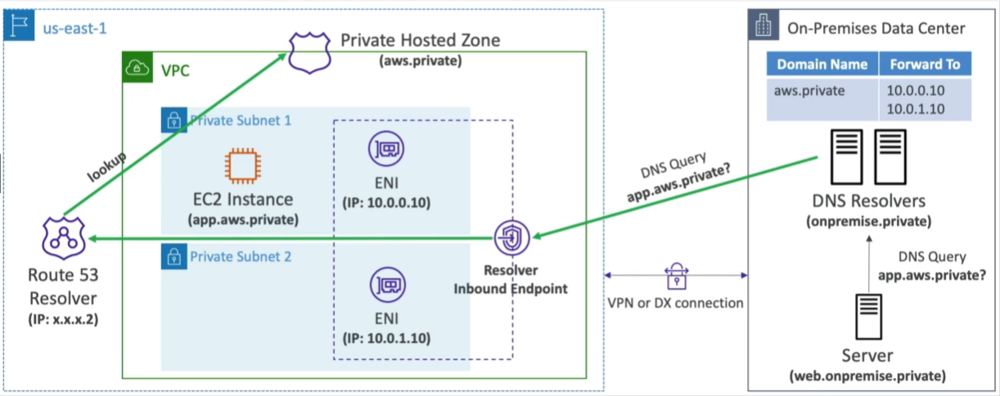
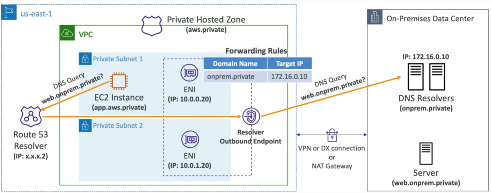

# Enhanced networking

**EC2 enhanced networking (SR-IOV)**
* higher bandwidth, hight PPS (packet per second), low latency
* option1 - Elastic Network Adapter (ENA) - up to 100Gbps
* option 2- Intel 82599VF uto to 10 Gbps (legacy)
* works on newer generation EC2 instances (from t3.x)

Checking ENA kernel module in Amazon Linux:
```
$modinfo ena
# if present, module in installed
```

Checking type of  NIC in system
```
$ethtool -i eth0
# driver should be ena not vif
```

**Elastic Fabric Adapter (EFA)**
* improved ENA (Elastic network adapter) for High PerformanceComputing - only works with Linux
* great for inter-node communications, tightly coupled workloads (lives in the same cluster)
* leverages Message Passing Interface (MPI) standard
* bypasses the underlying Linux OS to provide low-latency, reliable transport

# Route53

Managed DNS. Health checks and monitoring.

Entries types:
* A record - hostname to IPv4
* AAAA record - hostname to IPv6
* CNAME record - hostname to hostname
    * target must be a domain that have A or AAAA record
    * can't create CNAME record for the top node of DNS namespace (Zone Apex, ex: example.com)
* NS record - nameservers for hosted zone
* Alias record - hostname to AWS resource (ELB, CF, S3 websites, Elastic Beanstalk), cannot be set for EC2 DNS name, free of charge, native health check, can be used for the zone APEX

Hosted zones:
* private - contains records that specify how to route traffic within one or more VPCs
* public - contains records that specify how to route traffic on the Internet

Pricing: $0.50/month per hosted zone\
Domain: $12 per year

## Routing Policies:
* Simple Routing policy - route traffic to single resource
    * multiple values can be set to record
    * client will choose a random one
    * no health-checks

* Weighted routing policy - load-balancing based on host weights
    * you control the % of the requests that go to each resource
    * if all have 0, then traffic will be returned equally
    * DNS records must be the same name and type
    * health-checks
    * used for canary deployments

* Latency Routing policy - route traffic to instance with the lowest latency
    * creating the record - AWS region must be specified
    * client will get value from record with the nearest region

* Failover routing policy - failover instance in standby mode
    * must be associated with health-check
    * record must have failover record type set (primary/secondary)
    * active/passive - Route53 will return only active and healthy record

* GeoLocation - routing is based on users location (network)
    * specify location by continent, country or US state
    * default record should be created in case there's no match on location
    * can be associated with health-checks
    * use-cases: website localization, restrict content distribution, load-balancing

* GeoProximity - route traffic to your resources based on the geographic location of users and resources
    * its using Route53 Traffic flow feature to set coverage of the world by specific AWS regions in interactive way
    * ability to shift more traffic to regions based on the defined bias (priority)
    * for more traffic in given region (expand) set bias to positive (1 to 99), for less traffic in given region (shrink) set negative bias (-1 to -99)
    * resources can be form AWS (specify Region) or non-AWS (specify Latitude and Longitude)
    * pricing: $50 per month for a flow policy

* Multi-Value answer - route traffic to multiple resources
    * values in different records!
    * client side load balancing (that's not substitute to ELB)
    * health-checks, up to 8 healthy records to return
    * similar to simple-routing with many values, but have health-checks

## Health Checks
Automated DNS failover. Integrated with CloudWatch metrics. HTTP health-checks works only with public resources.

Health-checks can monitor:
* Endpoint - application, server, other AWS resource
    * about 15 global health-checkers
    * Healthy/Unhealthy threshold - 3 (default)
    * interval 30s (fast 10s = higher cost)
    * support: HTTP/HTTPS (status 200 and 300 is healthy), and TCP
    * If >18% of health-checkers reports the endpoint is healthy, Route53 consider it's healthy, otherwise Unhealthy
    * pass/fail based on fist 5120 bytes of the response
    * firewall must be open to traffic from checkers IP ranges
    * location can be set

* Another health-checks (Calculated Health-checks)
    * combine the results of multiple health-checks
    * conditionals: OR, AND or NOT
    * up to 256 child health-checks
    * used to perform maintenance of website without causing all health checks to fail

* CloudWatch Alarms (full control) - throttles of DynamoDB, alarms on RDS
    * used to provision health-checks on private resources (custom metric)

## S3 Website with Route53
* works only with HTTP, for HTTPS use CloudFront
* create s3 bucket with the same name as target record (acme.example.com) !!
* enable S3 website on bucket and public access
* create Route53 Alias record to the S3 website endpoint, or A record with value of S3 website endpoint

## Hybrid DNS
Every region has Route53 resolver that automatically answers DNS queries for:
* local domain names for EC2 instances
* records in private hosted zones
* records in public name servers

Hybrid DNS - resolving DNS queries between VPC (Route53 resolver) and your networks (other DNS Resolvers)
Networks can be:
* VPC itself / peered VPC
* on-prem network connected through Direct Connect or AWS VPN

### Resolver endpoints:
Managed DNS resolver for connecting on-prem and AWS DNS. Associated with one or more VPCs in the same AWS Region. Creates in two AZs for HA. Each endpoint supports 10k queries/s per IP address.

Inbound resolver:
* DNS resolvers on your network can forward DNS queries to Route53 resolver
* allows your DNS resolvers to resolve domain names for AWS resources and records in Route53 private zones



Outbound resolver:
* Route53 resolver conditionally forwards DNS queries to your DNS resolvers
* use Resolver Rules to forward DNS queries to your DNS resolvers



### Resolver rules:
Control which DNS queries are forwarded to DNS Resolvers on your network.
If multiple rules matched, Route53 resolver chooses the most specific match.

Conditional Forwarding Rules:
* Forward DNS queries for a specified domain and all its subdomains to target IP address

System Rules:
* Selectively overriding the behavior defined in forwarding Rules, ex: don't forward DNS queries for a subdomain acme.example.com

Auto-defined System Rules:
* Defines how DNS queries for selected domains are resolved, ex: AWS internal domain names, private hosted zones

# VPC
Virtual Private Cloud
* regional resource, span all AZs

## Subnets
* AZ resource, span one AZ
* Public subnet - accessible from internet
* Private subnet - NOT accessible from internet

* AWS reserves 5 IP addresses (first 4 and last one) in each subnet:
    * 10.0.0.0 - network address
    * 10.0.0.1 - VPC router
    * 10.0.0.2 - mapping to Amazon-provided DNS
    * 10.0.0.3 - for future use
    * 10.0.0.255 - Network Broadcast address

## Internet Gateway
* Used to connect instances to the internet.
* Public subnets have a route to Internet Gateway.
* Must be attached to VPC and route table to give access to the internet


## Route tables
* define access to the internet and between subnets

## Bastion host
* is used to give SSH access to host in private networks
* bastion host is localized in public subnet and have permissions to access private instances
* bastion host security group must allow inbound from the internet on port 22 from restricted CIDR (public cidr of your corporation)
* security group of EC2 instances must allow traffic from the security group of bastion host or it's private IP

## NAT

### NAT Instances
* allows instances in private subnet to access to internet while remaining private
* own managed, must have Elastic IP attached
* nat instance must be launched in public subnet
* must disable EC2 setting: Source/destination check on NAT instance
* dedicated AMIs in Marketplace (Amz)
* EC2 instances subnet must have Internet gateway with entry in route table to send internet traffic to NAT host

### NAT Gateway
* allows instances in private subnet to access to internet while remaining private
* AWS managed, higher bandwidth (5-45 Gbps), HA, no administration, no SG
* pay per hour and bandwidth
* NATGW is created in a specific AZ, uses Elastic IP
* cant be used by EC2 instance in the same subnet (only from another)
* requires an IGW (Private Subnet => NATGW => IGW)

### Egress-only Internet Gateway
Similar to NAT gateway but for IPv6.
Allows instances in your VPC outbound connections over IPv6 while preventing the internet to initiate an IPv6 connections to your instances. Route tables must be updated to use it.

## DNS in VPC

>To use custom DNS names in private hosted zones both attributes must be enabled.

### DNS resolution
(enableDNSSupport) decides if use Route53 resolver in this VPC. If enabled (default) it queries the Amazon DNS provider at address 169.254.169.253 or the reserved IP address at hte base of the VPC IPv4 network range plus two (.2).\
VPC - Right click - `Edit DNS resolution`

### DNS hostnames
(enableDnsHostnames) - if true assigns public hostname to EC2 instance if it has a public IPv4. To work `enableDnsSupport` must be true. Enabled by default only in  DefaultVPC.\
VPC - Right click - `Edit DNS hostnames`

## NACL
* Subnet level firewall
* allows traffic from and to subnet
* allow and deny (deny all for new acls)
* works on IPs
* default ACL is fully open
* stateless - return traffic must be turned on (with ephemeral ports 1027-65535)
* process rules in order as numbers 1-32766 (first rule match will drive the decision), AWS recommends adding rules by increment of 100
* last rule is an asterisk (*) and denies all request without a match

## Security group

* Resource level firewall
* controls traffic to and from EC2/ENI (Elastic Network Interface)
* can be attached to multiple EC2 or ENI
* access to ports, authorized IP ranges
* control of inbound (blocked by default) and outbound (allowed by default) traffic
* only Allow rules!
* works on IPs and other SecurityGroups
* stateful - return traffic is automatically allowed (regardless any rules)
* process rules at all (NOT in order)

## VPC Reachability analyzer

Cost $0.10 per analysis.

## VPC Peering
* connect two VPCs privately
* must be set between every pair of VPCs
* they will behave like they were in the same network (CIDRs cannot overlap)
* you can create VPC Peering connection between VPCs in different accounts/regions
* you can reference a SG in a peered VPC (works cross accounts - same region)
* route tables in each vpc must be updated: main VPC CIDR as destination and peering connection as a target


## VPC Endpoint

Connect AWS services by private network instead public Internet (S3, DynamoDB, CloudWatch).

* batter security
* low latency


### VPC Endpoint Gateway (service)
* ONLY for S3 and DynamoDB (preferred)
* provisions a gateway and must be used as a target in a route table (don't need SG)
* region must be specified while access (the same)
* free of charges

### VPC Endpoint Interface (ENI)
* for the rest of services
* provisions an ENI (private IP address) as an entry point, SG must be attached
* powered by AWS Private Link
* for S3 preferred when access is required form on-prem, a different VPC or region
* cost per hour + per GB of processed data


## Flow Logs

Capturing information about IP traffic.
* VPS flow logs
* Subnet Flow logs
* ENI flow logs

Captures information from AWS managed interfaces (ELB, RDS, NATGW, etc.)
Data can be sent to S3 or CloudWatch.
Action - success or failure of the request due to SG/NACL
Can be used for analytics on usage patterns or malicious behavior.

Incoming requests:
* inbound REJECT => NACL or SG problem
* Inbound ACCEPT, Outbound REJECT => NACL problem for sure

Outgoing requests:
* Outbound REJECT = > NACL or SG problem
* Outbound ACCEPT, Inbound REJECT = > NACL problem for sure


## Site-to-site VPN

Goes over public Internet.

Steps:
* create customer gateway
* create virtual private gateway
* create Site-to-site VPN connection

* Virtual Private Gateway (VGW)
    * AWS site (VPN concentrator)
    * created and attached to the VPC from  connection have to be created
    * possibility to customize ASN (Autonomous System Number)
    * enable Route Propagation for the VPG in the route table that is associated with your subnets
    * enable ICMP in SG

* Customer Gateway (CGW)
    * on-premise site (software or device)
    * list of tested devices
    * public static IP address or IP of NAT device (NAT traversal must be enabled)

### VPN CloudHub
* provide secure communication between multiple sites, if you have multiple VPN connections
* low cost hub-and-spoke model for primary or secondary network connectivity between different locations (VPN only)
* to set it, connect multiple VPN connections to the same VGW, setup dynamic routing and configure route tables

## Direct Connect (DX)

Physical dedicated connection between AWS and on-premise resources.
More secure, over private network. VGW must be set.
Takes at least a month to establish. Data is not encrypted (must use DX + VPN)

Connection types:
* Dedicated connections
    * 1, 10 and 100 Gbps
    * physical ethernet port dedicated to the customer
    * AWS Direct Connect Partners request
* Hosted connections
    * 50, 500 Mbps up to 10 Gbps
    * connection requests are made via AWS Direct Connect Partner
    * capacity can be added or moved on demand

### Direct Connect Gateway
Used to setup a direct Connect to one ore more VPC in many different regions (same account). Uses private virtual interfaces in all places.

High resilience - one connection at multiple locations.
Maximum resilience - separate connections terminated on separate devices in moe than one location.

## PrivateLink
Most secure and scalable way to expose a service to 1000s of VPCs (ow or another accounts). Doesn't require VPC peering, internet gateway, NAT, route tables etc.
Requires a NLB - Network Load Balancer (Service VPC) and ENI (Customer VPC) or GWLB. If the NLB is in multiple AZ, and the ENIs are in the multiple AZ, the solution is fault tolerant.

ECS - ALB - NLB - AWS PrivateLink - Client ENI or DX

## Transit Gateway

Router for complicated AWS topologies. Transitive peering between thousands of VPCs and on-prem. All connected to it (one single gateway) that allows traffic.

* Use hub and spoke topology (star).
* Regional resource, can work cross-region (by Resource Access Manager).
* Peering Transit Gateways across regions.
* Route tables limit traffic between VPCs.
* Works with Direct Connect Gateway and VPN connections.
* Can be used to share Direct Connect between multiple accounts.
* Supports `IP Multicast` as only service in AWS.

### Site-to-site VPN ECMP
ECMP - Equal-cost multi-path routing

Used to create multiple Site-to-site VPN connections to increase the bandwidth of your connection to AWS. Forward strategy to allow forwarding packets over multiple best-paths.

## Traffic Mirroring
* allows to capture and inspect network traffic in VPC
* route traffic to the your security appliances

Capture the traffic:
* from (source) - ENIs
* to (destination) an ENI or a NLB

## Network Firewall
* protect your entire VPC
* from layer 3 to 7
* any direction, you can inspect:
    * VPC to VPC traffic
    * outbound to Internet
    * Inbound from internet
    * to/from Direct Connect & Site-to-site VPN
* filter by:
    * IP and port
    * protocol, ex: block SMB
    * stateful domain list rule groups, ex: only allow outbound traffic to *.mycorp.com or third-party software repo
    * general pattern matching using regex
* allow, drop or alert for the traffic that matches the rules
* active flow inspection to protect against network threads with intrusion-prevention capabilities
* internally it uses Gateway Load Balancer with virtual security appliance
* rules can be centrally managed cross-account by AWS Firewall Manager to apply to many VPCs

# Networking pricing
* free traffic IN from internet
* traffic inside AZ is free (if private IPs are used)
* $0.01 per GB when traffic between AZs in the same region (Private IP)
* $0.02 per GB when traffic between AZs in the same region (Public/Elastic IP)
* $0.02 per GB when traffic between regions

Egress traffic (outbound) - from AWS to outside

Ingress traffic (inbound) - from outside to AWS (free)

Best practices:
* use private IP instead public
* use the same AZ for cost savings (no HA!)
* process data into AWS to send as less data as possible

S3 costs (USA):
* S3 ingress - free
* S3 egress - $0.09 per GB
* S3 transfer acceleration - + $0.04 t $0.08 per GG (50-500% faster)
* S3 Cross Region Replication - $0.02 per GB
* S3 to CloudFront - free
* CloudFront to Internet - $0.085 per GB (caching capability)

Private EC2 to S3:
* with VPC Endpoint
    * $0.01 data transfer in/out
    * Gateway Endpoint - free
* with NAT Gateway
    * $0.045 NAT GW per hour
    * $0.045 NAT GW data processed
    * $0.09 data transfer out if cross-region