# Observability
The ability to measure and understand how internal systems work in  order to answer questions regarding performance, tolerance, security and faults with a system/application.

To obtain observability you need to use Metrics, Logs and traces. you have to use them together!

>Metrics - variable to monitor CPU, RAM etc. Has timestamps.

>Traces - a history of requests that is travels through multiple apps/services so we can pinpoint performance or failure.

>Insight - wgląd, rozeznanie

# CloudWatch

Monitoring solution for AWS resources.

Umbrella service - collection of monitoring tools as:
* Logs - any log data (custom too)
* Metrics - represents a time-ordered set of data-points
* Events - trigger an event based on a condition
* Alarms - triggers notifications based on metrics
* Dashboards - create visualizations based on metrics
* Service Lens - visualize and analyze the health, performance, availability of your app in a single place
* Container insights - collets, aggregates and summarizes metrics and logs from your containerized apps and microservices
* Synthetics - test your web apps to see if they're broken
* Contributor Insights - view the top contributor impacting the performance of your systems and apps in real time

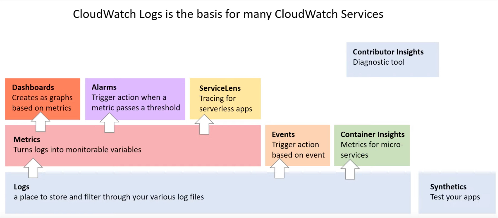
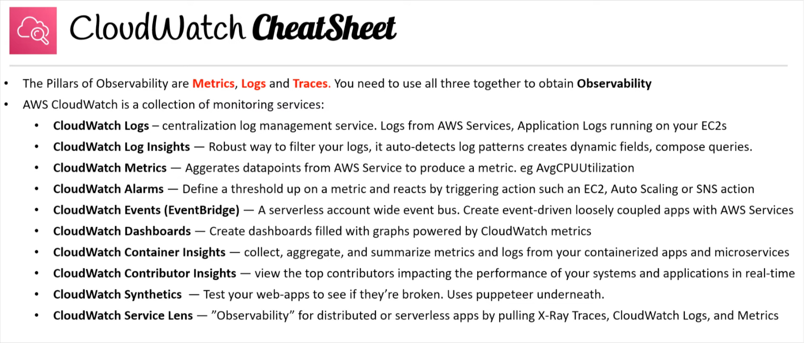

## CloudWatch LOGS

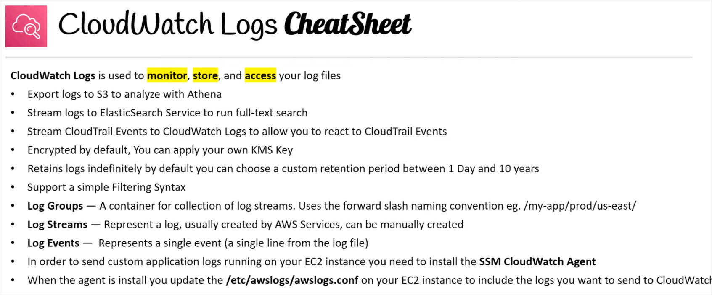

### AWS Logs

Service logs:
* CloudTrail trails - trace all API calls
* Config Rules - for Config and compliance over time
* CloudWatch logs - for full data retention
* VPC Flow logs - IP traffic within your VPC
* ELB Access logs - metadata of requests made to load-balancers
* CloudFront logs - web distribution access logs
* WAF logs - full logging of al requests analyzed by the service

Logs can be stored in S3 and analyzed using Athena.
Log protection: S3 encryption, control access using IAM and Bucket Policies, MFA on deletion. Can be moved to Glacier for cost savings.

Sources:
* SDK
* CloudWatch log agent (unified)
* ElasticBeanstalk application
* ECS - logs from containers
* Lambda - logs from function
* VPC Flow Logs
* CloudTrail based on filter
* Route53 DNS queries
* API gateway

Destinations:
* S3 (exports)
* Kinesis Data SStream
* Kinesis Data Firehouse
* AWS Lambda
* Elasticsearch

>Log event - single event in a log file

>Log stream - sequence of events from monitored application or instance

>Log groups - collection of log streams. Name that is representing application (can be any name).


### Encryption
By default, log groups are encrypted at rest using SSE. Own Customer Master Key from KMS can be used.

### Retention
By default logs never expire.
Log expiration policies - can be set to amount of time (1day to max 10 years) for each log group or disable retention.

### Filtering
Filter expressions - can be used to ex: find specific IP within a log or count "ERROR" occurrences (create metric) and trigger CloudWatch Alarm.

Subscription Filter - can be used to send logs into other services (Lambda, ES, Kinesis) in near real-time.

#### Log Insights

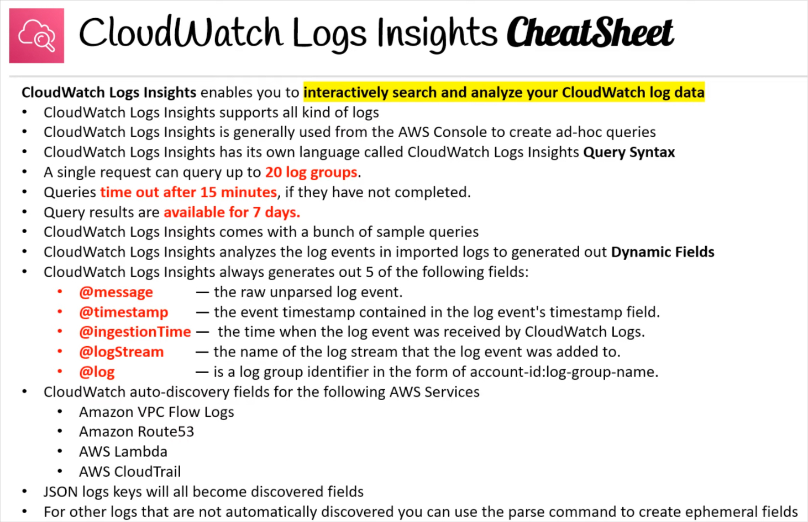

Interactively search and analyze CloudWatch log data.
More robust filtering than using the simple filter events in a log stream.
More simple than analyzing logs in Athena.
Used to do ad-hoc queries against log groups via AWS Console.
Can be used to add queries to CloudWatch Dashboards.

Has its own language called `CloudWatch Logs Insights Query Syntax`.
AWS provides sample queries for common tasks.

Insights analyze the log event and try to structure the content by generating fields that you can use in the query (log parsing).

Five system fields (automatically generated):
* @message - the raw, unparsed log event
* @timestamp
* @ingestionTime - time when the log event was received by CW logs
* @logStream - the name of the log stream that the log event was added to
* @log - log group identifier in the form of: account-id:log-group-name

### Agent
CloudWatch log agent - can be installed on EC2 machines or on-premise servers to collecting logs from instance in CloudWatch.

Agent config file:
`/etc/awslogs/awslogs.conf`

Restarting:
```
sudo service awslogsd stop
sudo service awslogsd start
```

Install by AWS Systems Manager SSM Run command (AWS-ConfigureAWSPackage).

`CloudWatchAgentServerRole` must be enabled on EC2!

## CloudWatch METRICS

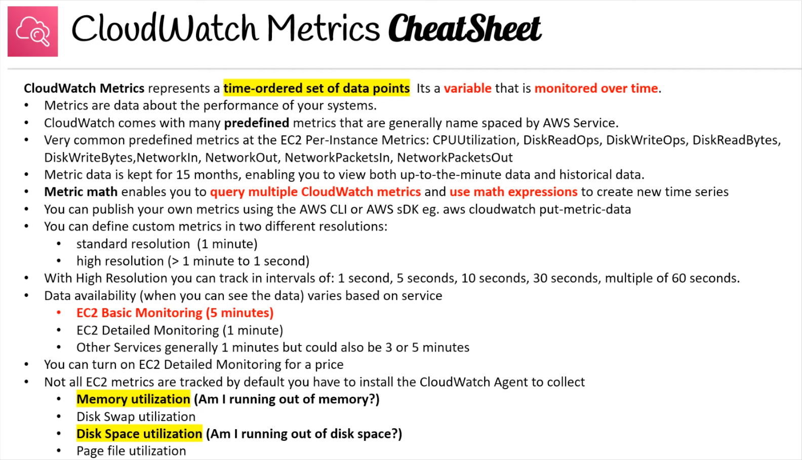

>Metric - a time ordered set of data points.\
>Variable, that is monitored over time.

Metrics belongs to namespaces (groups).\
Dimension is an attribute of a metric (instance id, environment, etc...).\
Column name in AWS Console. Up to 10 dimensions per metric.

### Intervals
Basic monitoring: 1min / 3min / 5min;  **for EC2: 5min**\
Detailed monitoring: N/A; **for EC2 - 1min (extra paid)**

Billing - Total Estimated Charge is available only in us-east-1 (for whole account)

### Metric types

Host level metrics (without agent):
* CPU usage
* network usage (transfer)
* disk usage
* status checks

Agent level metrics:
* memory utilization
* Disk swap utilization
* Disk space utilization
* page file utilization
* log collection

Important metrics:
* `NetworkIn` and `NetworkOut` - usage of network by instance
* `DataTransfer-Out-Bytes` - used in AWS Cost Explorer reports to see pricing
* `DiskReadBytes`, `DiskWriteBytes` - data from all instance volumes, determine speed of application
* `ResourceCount` - metric used to determine the amount of resources running in the account

Custom Metrics

For custom metrics is used API call: PutMetricData. It can be send with with dimensions (attributes) to segment metrics: Instance.Id, Environment.name.

Examples:
* memory usage (RAM)
* disk space
* number of logged users

Resolution:
* standard - 1min
* high resolution: 1, 5, 10, 30 seconds (higher cost)

You can retrieve custom metrics from your applications or services using the `StatsD` and `collectd` protocols. StatsD is supported on both Linux servers and servers running Windows Server. collectd is supported only on Linux servers.

Metrics are accepted with timestamp for 2 weeks in the past and 2 hours in the future. You must be sure about time settings in your server.

Push metric data:
```bash
aws cloudwatch put-metric-data --metric-name Test --namespace "Usage Metrics" --metric-data file://metric.json
```

```json

[
  {
    "MetricName": "New Posts",
    "Timestamp": "Wednesday, June 12, 2013 8:28:20 PM",
    "Value": 0.50,
    "Unit": "Count"
  }
]
```
```bash
aws cloudwatch put-metric-data --metric-name Buffers --namespace MyNameSpace --unit Bytes --value 231434333 --dimensions InstanceID=1-23456789,InstanceType=m1.small
```

## CloudWatch ALARMS

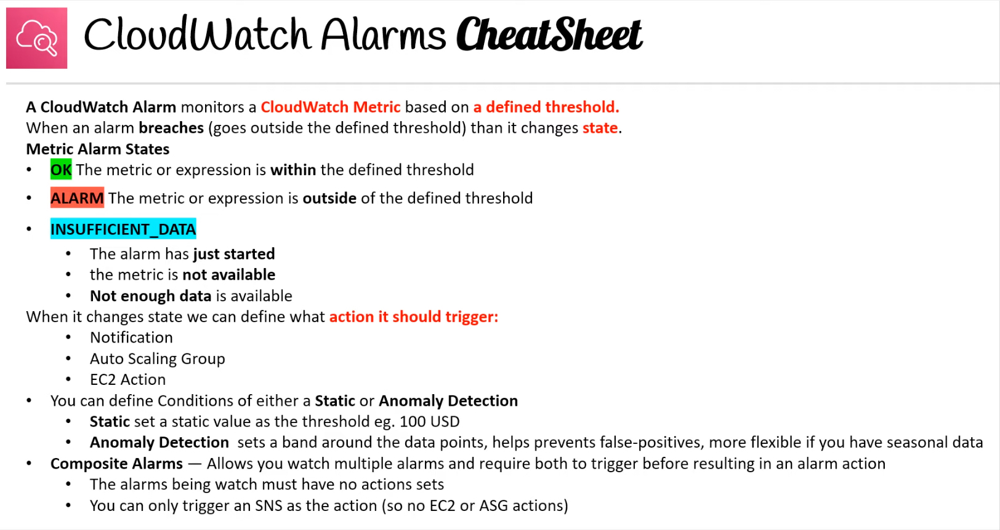

Trigger notifications for any metric.
A CloudWatch Alarm monitors a CloudWatch Metric based on a defined threshold.

Alarm states:
>OK                 - all is alright\
>INSUFFICIENT_DATA  - not enough data points to decide\
>ALARM              - when state is wrong

Targets:
* EC2 - stop, Terminate, Recover instance
* ASG - trigger Auto-scaling action
* SNS - send notification into an SNS topic (later to Lambda)

>Metric - the actual data we are measuring\
>Data-point - represents the metric's measurement at a given period\
>Threshold condition - defines when a data-point is breached (over the limit)\
>Period - how often it checks to evaluate the alarm\
>Evaluation periods - number of previous periods\
>Data-points to alarm - 1 data point is breached in an evaluation period going back 4 periods. This is what triggers the alarm.

### Composite alarms
Alarms that monitor other alarms. Used to reduce alarm noise.

Configuring 2 alarms with `no action`: CPU Utilization and NetworkIn. For this 2 alarms composite alarms is created with condition: `ALARM("CPU Uilization)" AND ALARM("Network_In")`. Action for this alarm can be only SNS Topic!

EC2 Status check:
* Instance status - check the VM
* System status - check the underlying hardware
* cannot be disabled

StatusCheckFailed_System - can be used to recover the EC2 (same subnet, Elastic IP, metadata, placement group).

To set the alarming state (testing) use CLI:\
`aws cloudwatch set-alarm-state --alarm-name "my-alarm" --state-value ALARM --state-reason "testing purposes`

## CloudWatch EVENTS

Make an action on target when event occur on source by creating Event rule.

>Fourth pillar of observability.

* Event pattern - get events from AWS services (sources) to make reaction (SNS topic when IAM root user logged in). Can get any API call using CloudTrail integration.
* Schedule cron jobs

JSON payload is created from the event and passed to a target:
* compute - Lambda, Batch ECS task
* integration - SQS, SNS, Kinesis
* orchestration - Step functions, CodePipeline, CodeBuild
* maintenance - SSM, EC2 Action

### Amazon EventBridge

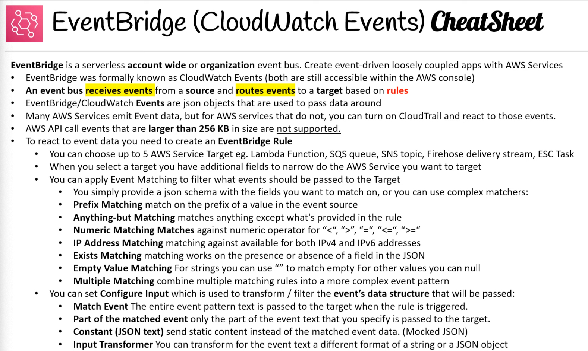
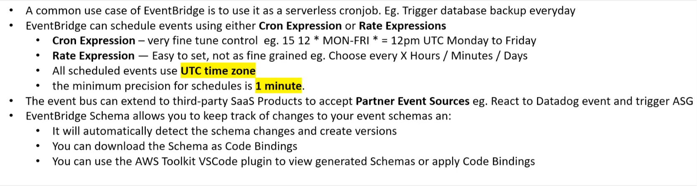

Evolution of CloudWatch events. It uses teh same service API and endpoint.

Event bus receives events from a source and routes them to a target based on a rules.
It's a `serverless` event bus service that is used for application integration by `streaming real-time data` to your application.

* Default Event BUS - generated by AWS services (CloudWatch Events)
* Partner Event Bus - receive event from SaaS service or applications (DataDog, Auth0)
* Custom Event Buses - for your own applications, scoped to multiple AWS accounts

>Producers - AWS services that emit events.

>Events - data emitted by services, JSON objects that travel (stream) within event bus.

>Rules - defines how to process the events (100 rules per bus)

>Targets - AWS services that consume events (5 targets per rule)

>Partner sources - third-party apps that can emit events to an event bus

Events can be archived after sent to Event Bus, and replayed from archive.

#### Event
```json
{
  "account": "123456789012",
  "region": "us-east-1",
  "detail-type": "CodeDeploy Deployment State-change Notification",
  "source": "aws.codedeploy",
  "version": "0",
  "time": "2016-06-30T22:06:31Z",
  "id": "c071bfbf-83c4-49ca-a6ff-3df053957145",
  "resources": [
    "arn:aws:codedeploy:us-east-1:123456789012:application:myApplication",
    "arn:aws:codedeploy:us-east-1:123456789012:deploymentgroup:myApplication/myDeploymentGroup"
  ],
  "detail": {
    "instanceGroupId": "9fd2fbef-2157-40d8-91e7-6845af69e2d2",
    "region": "us-east-1",
    "application": "myApplication",
    "deploymentId": "d-123456789",
    "state": "SUCCESS",
    "deploymentGroup": "myDeploymentGroup"
  }
}
```

Metadata - top level fields\
Content - in `detail` key

#### Scheduled Expressions

* UTC time zone
* 1 minute minimum precision
* cron expressions and rate expressions (ex: every 8 hours)

EventsBridge rules can be triggered by schedule - serverless` Cron jobs`.

#### Rules

Commonly targeted services:
* Lambda function (with optional version)
* SQS queue
* SNS topic
* firehouse delivery system
* ECS task

Configure input - sort or filter what gets passed to process by rule:
* Match events - the entire event pattern text is passed to the target when rule is triggered
* part of the match event - only the part of the event text that you specify is passed to the target ($.detail)
* Constant (JSON text) - send static content instead of the matched event data - Mocked JSON ({"success":true})
* Input transformer - ypu can transform the event text to a different format of a string or a JSON object. You map fields from the event data to variables, then you can use those variables in a string or JSON object and that will be passed to target.

#### Event pattern
Are used to filter what events should be used to pass along to a target.
You can filter events by providing the same fields and values found in the original events.

Simplified:
Cut only needed values from event's JSON and use it to match if event should be passed to target or not. Ex: EC State change notification - only when state is "Terminated".

Patterns:
* prefix matching
  * `"region" : [{"prefix": "ca-" }]`
* anything-but matching
  * `"state": [{"anything-but": ["stopped", "overloaded"]"}]`
* numeric matching
  * `"x-imit" : [{"number": [ ">", 0, "<=",5 ] }]`
* IP address matching
  * `"source-ip": [{ "cidr": "10.0.0.0/16"}]`
* exist matching
  * `"c-count": [{"exists": false}]`
* empty value matching
  * `"version": [null]`
* complex example with multiple matching
  * combination of many

#### Schema Registry:
Event Bridge can analyze the events in bus and gather the schema.

Schema ia an outline, diagram or model. Schemas are often used to describe the structure of different types of data (similar to terraform variable type).

```json
{
    "openapi": "3.0.0",
    "info": {
      "version": "1.0.0",
      "title": "Event"
    },
    "paths": {},
    "components": {
      "schemas": {
        "Event": {
          "type": "object",
          "properties": {
            "ordinal": {
              "type": "number",
              "format": "int64"
            },
            "name": {
              "type": "string"
            },
            "price": {
              "type": "number",
              "format": "double"
            },
            "address": {
              "type": "string"
            },
            "comments": {
              "type": "array",
              "items": {
                "type": "string"
              }
            },
            "created_at": {
              "type": "string",
              "format": "date-time"
            }
          }
        }
      }
    }
  }
```

Schema (JSON) registry allows you to generate the code from your application, that will know in advance how data is structured in the event bus. Schema can be versioned.

EventBridge schema registry allows you to create, discover and manage OpenAPI schemas for events on EventBridge.


Schemas are used to see if the structure of events have changed over time. This makes easier to developers to know what data type expect from a type of event, so its easier to integrate into applications.

Code Binding is when the schema is wrapped in a programming Object. This standardizes how to work with event data in the code loading to fewer bugs and easier discovery of data.

Resource-based Policy:\
Event Buses can be accessed from other AWS accounts. Policy manage permissions for a specific Event Bus, ex: allow/deny events from another AWS account. Use-case: to aggregate all events from AWS Organization in a single AWS account.

For Lambda functions and Amazon SNS topics configured as a target to EventBridge, you need to provide resource-based policy. IAM roles for rules are only used for events related to Kinesis Streams.

For Lambda, Amazon SNS, Amazon SQS, and Amazon CloudWatch Logs resources, EventBridge relies on resource-based policies. For Kinesis streams, EventBridge relies on IAM roles.

Sandbox:\
Test rules and patterns without creating the rule.

#### CloudTrail events
Turning on CloudTrial allows EventBridge to track changes to AWS Services made by API calls or by AWS Users.The detail type of CloudTrail will be called: `AWS API Call via CloudTrail`. Max API call event is 256KB.

## CloudWatch DASHBOARDS
* dashboards are global
* can include graphs from different AWS accounts and regions
* timezone and time range can be changed
* automatic refresh (10s-15m)
* can be shared with people without AWS account (public, email address, 3rd party SSO through Amazon Cognito)
* 3 dashboards (up to 50 metrics) for free, $3 per dsb per month

## Service Lens
Performing distributed (microservices) applications `Observability` by consolidating metrics, traces, logs and alarms into a one unified dashboard.

ServiceLens integrates CloudWatch with X-Ray to provide an end-to-end view of your application to help you efficiently:
* pinpoint performance bottlenecks
* identify impacted users

Integration with CloudWatch Synthetics.

Service map - displays your service endpoints as `nodes` and highlights the traffic, latency and errors for each node and its connections. Map view and List view.

>Insert screen

Log correlation with:
* Lambda functions
* API gateway
* Java-based apps on EC2, EKS, ECS
* Kubernetes with Container Insights

To install and use ServiceLens:
* deploy X-Ray (instrument your services)
* deploy CloudWatch agent and X-Ray daemon

Filtering  trace information to open in X-Ray analytics.

## ClodWatch Synthetics

Canary - configurable script that runs on a schedule to monitor your endpoints and APIs. Canaries mimic steps to real user would take, so you can `continuously verify the customer experience`.

Synthetics is used to `test web apps` by creating canaries to:
* broken and dead links
* step-by-step completion
* page load errors
* load latencies of assets
* Complex wizard flows
* checkout flows

Canaries run on AWS Lambda using Node.js and Puppeteer.

>Puppeteer - headless chrome browser and an automatic testing framework. Can be coded to open web-browser and click to enter information into a website.

Canaries blueprints:
* Heart Beat monitoring - check a single page is it still alive
* API Canary - used to check API endpoint (method, headers, Payload)
* Broken link checker - supply a URL and check links on the page
* GUI workflow builder - test a sequence of steps that makes up a workflow (actions: Click, Input text, verify text)

## CloudWatch Contributor Insights

### Container Insights

Collects, aggregates and summarizes information about your containers from metics and logs.

Works with:
* ECS
* ECS Fargate
* EKS
* Kubernetes on EC2 instances

Metrics collected by Container Insights are available in CloudWatch automatic dashboards.
You can analyze and troubleshoot container performance and logs data with CloudWatch Insights. Operational data is collected as performance log events. These are entries tat use a structured JSN schema that enables high-cardinality data to be ingested and stored at scale.

Filtering by: Cluster, Node, Pod, Task, Service level.

Contributor Insights allows you to view top contributors impacting the performance of your systems and application in `real time`. It looks at your CloudWatch logs and based on Insight rules you define shows `real time time-series data`. Sample rules available.


# CloudTrail (ślad)

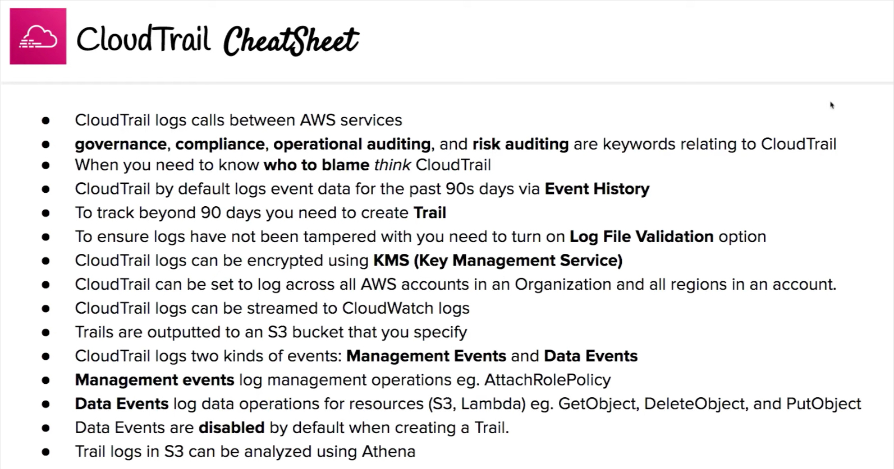
When you want to know `Who to blame?`

Governance, compliance operational and risk audit for AWS account. Enabled by default.
History of events/API calls within account (console, CLI, SDK connections), can put logs to CloudWatch or S3.

## Events types:
* `Management Events` (logged by default) - operations performed on resources: create resource, attach policy. Read and Write events (modifications). No charges, KMS events can be excluded (amount). Can't be turned off.

* `Data Events` (not logged by default, additional charges) - operations on S3 object level (Get, Put, Delete Object) and Lambda executions. Read and Write events.

* `Insight Events` (additional payment) - detect unusual activities (service limits, provisioning problems, gaps in maintenance). Create baseline of normal activity and continuously analyze write events.

## Trail Options
* trail can be set to log to all regions
* trail can be set to across all accounts in an Organization
* you can encrypt logs using Server Side Encryption via SSE-KMS
* you can enable `log file integration` to be sure that logs weren't manipulated
* logs can be sent to deliver events to CloudWatch

## Retention
Events are stored by default for 90 days (Event history with GUI). If more needed then create a `Trail`. Data can be stored in S3 to use in Athena (SQL analysis).

### Log File Integrity Validation
Digest Files - reference of log files from last hour - contains hash of each log file. Is stored in the same bucket as logs, but in different directory (index).
Determine if log file was modified after deliver by CloudTrail. Bucket should be protected by: policy, versioning, MFA Delete Protection, encryption, object lock.

Integration with EventBridge
Every API call can be sent to Event Bridge. Cloudtrail is not real-time, 15 min for event delivery, 5 mins to store log file in S3 bucket.

Organization Trails
CloudTrail can be set on Organization level - events from all accounts in Organization. Member accounts have read-only access to it't trails.

# Service Quotas

How near you are from reaching service limits. CloudWatch Alarm can be set when you're close to threshold. You can check any type of actions and request for higher quota value.

# AWS Config

Record configurations of services and it's changes over time for audits and compliance needs. Use rules to check if current config is compliant or not. Rules don't prevent actions from happening - it's only view of changes. Configuration data can be stored in S3 to analyze in Athena. Alerts using SNS notifications when configuration changes (resource is non-compliant). Per region service, data can be aggregated form many regions. Paid service.

AWS Config is disabled by default. After enabling it will discover resources within the region and create `Resource Inventory` for free?.

Use cases:
* want this resource to stay configured a specific way for compliance
* want to keep track of configuration changes to resources
* want to list all resources within a region
* want to use analyze potential security weaknesses, you need detailed historical information

Problems:
* Is any unrestricted SSH access in my security groups?
* Do any of my buckets have public access?
* Has my ELB configuration changed over time?

### Config Rules:
AWS Lambda's designed to check if a desired configuration is met on AWS resource.

Types:
* AWS managed config rules (over 100+), cannot change trigger type, but other settings are possible: Scope of changes, Frequency
* custom rules (must be defined in AWS Lambda), trigger type can be changed

Rules can be evaluated/triggered:
* for each config change:
  * all changes - when any resource recorded by AWS Config is created changed or deleted
  * resources - when any resource that matches the specified type, or the type plus identifier is created, changed or deleted
  * tags - when any resource with specified tag is created, changed or deleted
* scheduled (periodic)

>Pricing - $0.003 per configuration item recorded, $0.001 per config rule evaluation.

### Resource timelines

Timeline of changes:
* Configuration timeline - when changes have been made to the resource
* Compliance timeline - when resource has become uncompliant with a rule

### Remediation (korekta)
Non-compliant resources can be remediated (action of reversing, stopping or correcting something) using SSM Automation Documents (can be custom). Max 5 Remediation Retries. Ex: deactivate ssh keys older than 90 days.

### Aggregators
One AWS Account that has enabled aggregator - centralized view of config from all source accounts. It's aggregates rules, resources, etc across multiple account and regions. Without Organizations on all account must be created authorizations.
Rules are created in each account separately, to deploy rules to multiple target account CloudFormation StackSets must be used.

Rules - represents your desired configuration settings. Can be seen across regions and source accounts.

Resources - resources across regions and accounts.

Authorizations - grants permission to the aggregator accounts and regions to collect AWS Config configuration and compliance data.

### Conformance pack
Collection of AWS Config rules and remediation actions that can be easily deployed as a single entity in an account in a Region or across an AWS Organization. Packs are created by authoring a YAML template that contains the list of rules (managed or custom) and remediation actions.

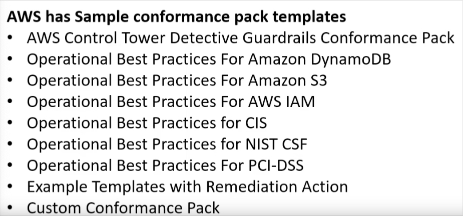

### Advanced queries
Allows to write SQL Queries to quickly find resources within your AWS account, cross-region and cross-account.

---

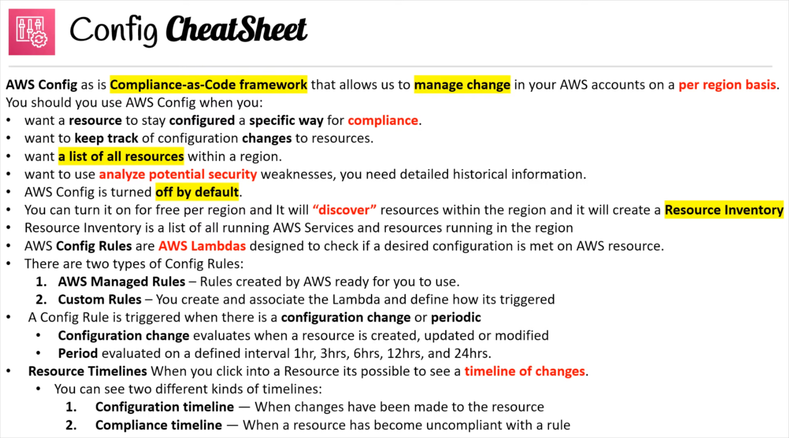
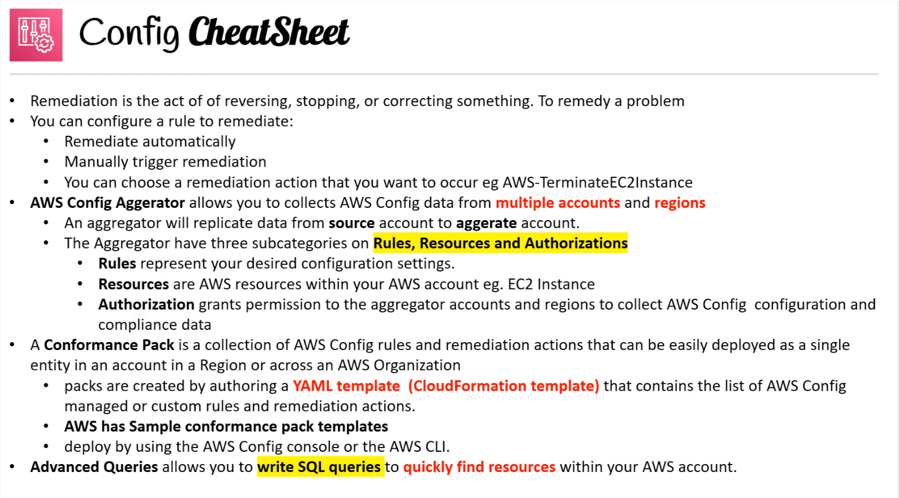
