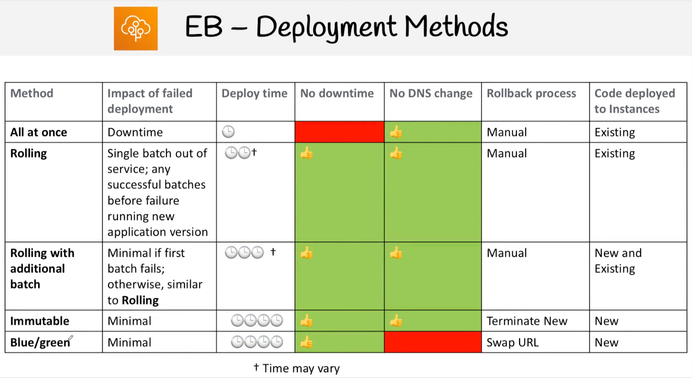
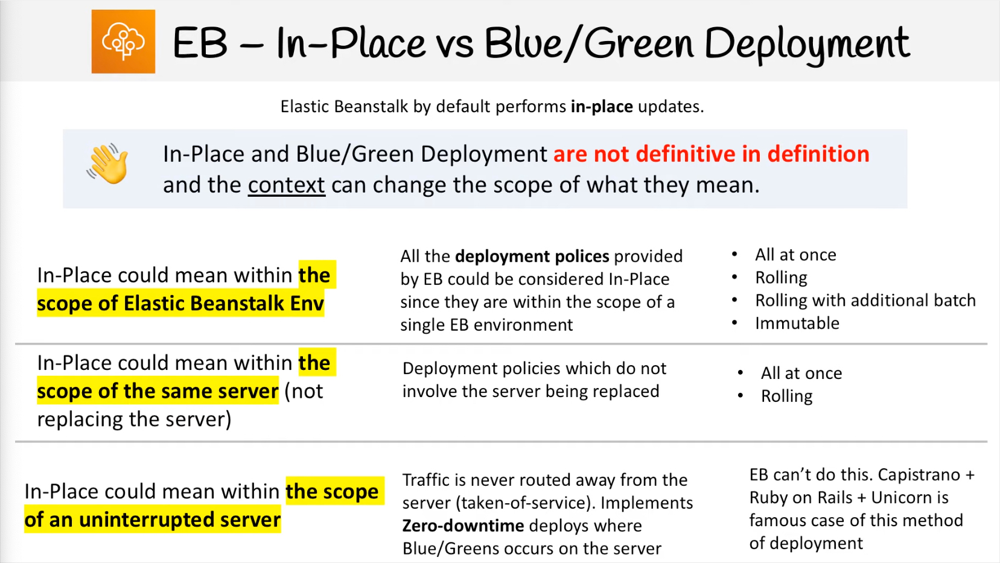
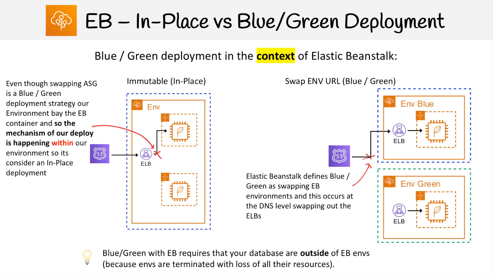
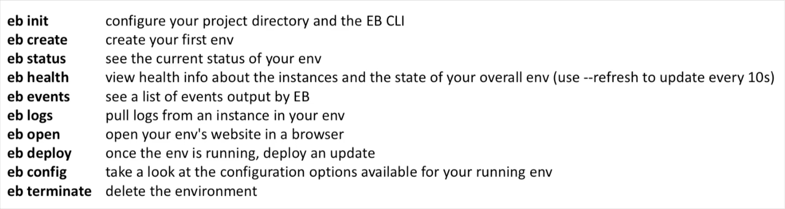
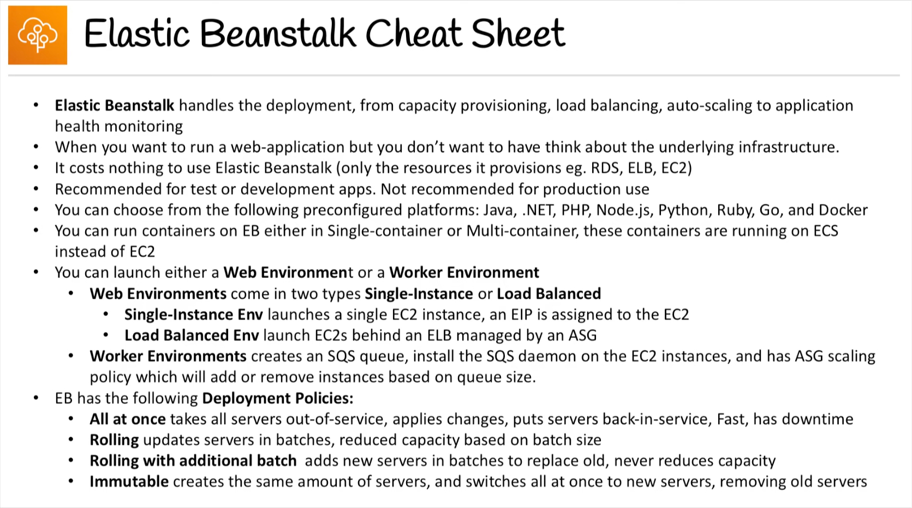
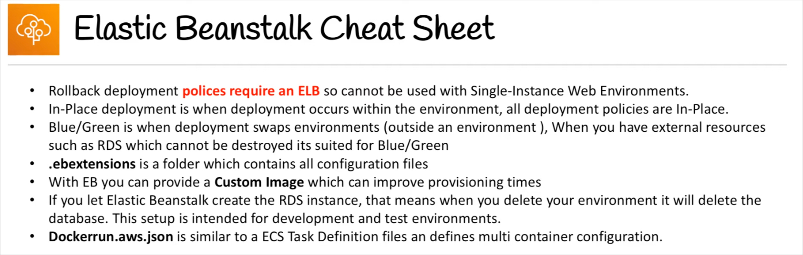

## Resource groups
Logical groups of resources that share the same tags. Regional service.
Can be made on CloudFormation stack.

Tag “Name” will set EC2 name on instances list.

---

## Elastic Beanstalk
Platform as a Service. Layer that use all the components: EC2, ASG, ELB, RDS.  Free service - payment for used resources. Based on CloudFormation templates.

Architecture models:
* single instance - for dev environments
* LB + ASG - for production or pre-production web apps
* ASG only - for non-web apps in production (using queue)

Components:
 * application - collection of Elastic Beanstalk components (environments, versions, configurations)
 * version - each deployment gets assigned version (iteration)
 * environment (dev, test, prod - free naming) collection of AWS resources running the application version (only one version at a time)
 * tiers: web server environment & worker environment

After deploying app version to giver environment, you can promote app version to next environment. Can do rollbacks.

Create app -> upload version -> launch environment -> manage environment

Web Server tier - http endpoint, ELB + ASG + EC2
Worker tier - SQS Queue + ASG (scale based on SQS messages amount


### Deployment policies

|Deployment policy|Load balanced env|Single instance env|
|------| ------|  ------|
|All at once | yes | yes |
|Rolling | yes | no |
|Rolling with additional batch | yes | no |
|Immutable | yes | yes |

#### All at once
The fastest and the most dangerous.

1. Deploy the new app version to all instances at the same time.
2. Takes all instances `out of service` while the deployment process.
3. Server becomes available again.
4. In case o failure you need to roll back the changes by re-deploying older app version to all instances.

#### Rolling deploys
Slow but secure deployment method.

1. Deploy the new app version to a small group of instances at the time.
2. Takes a batch of instances `out of service` while the deployment process.
3. Reattaches updated instances.
4. Goes onto next batch, taking them out of service.
5. Reattaches those instances (rinse and repeat).
6. In case of failure you need to perform an additional rolling update in order to roll back the changes.

#### Rolling updates with additional batch
Slow, but very secure deployment method. No reduce of capacity!

1. Launch new instance that will be used to replace a batch.
2. Deploy update app version to the new batch.
3. Attach the new batch and terminate the existing batch.
4. In case of failure you need to perform an additional rolling update to roll back the changes.

#### Immutable
The safest way to deploy for critical applications.

1. Create a new ASG with EC2 instances.
2. Deploy the updated version of the app on the new EC2 instances.
3. Point the ELB to the new ASG group and delete the old ASG which will terminate the old EC2 instances.
4. In case of failure you just terminate the new instances since the existing instances still remain.




*in exam use the scope of Elastic Beanstalk




### Config files
`.ebextensions` - hidden folder called at the root of your project which contains config files\
`.config` - extension of the config files

Configurable:
1. Option settings
2. Linux/Windows server configuration
3. Custom resources

#### Linux server configuration

Packages - download and install prepackaged applications and components (use yum)
Groups - Linux/Unix groups config
Files - create files on the EC2 instance
Commands - execute commands on the EC2 instance before app is setup
Services - define which services should be started or stopped when the instance is launched
Container Commands - execute commands that effect your application source code (not about Docker, container means EB's runtime environment)

### Environment manifest
`env.yml` - in root of project. File allows you to configure the defaults like:
* environment name (+ on name's end means group)
* stack solution (programming language)
* associating the `environment links`
* default configuration of services etc

### CLI

Clone [the repo](https://github.com/aws/aws-elastic-beanstalk-cli-setup.git), then:
```sh
./aws-elastic-beanstalk-cli-setup/scripts/bundled_installer
```

Commands:


### Custom image
You can specify own AMI to use instead standard EB AMI. It may improve provisioning times. Or maybe you need a lot of other software that isn't installed on environment.

```sh
aws elasticbeanstalk describe-platform-version --region [REGION] --platform-arn [USED_PLATFORM_ARN] --query PlatformDescription.CustomList
```

This will return AMI id that can be used to as base tof modifications for given platform. Build own AMI from that one.

### RDS configuration

Inside EB ENV - intended for development envs. You create DB within EB - when it's terminated, RDS is terminated too.

Outside EB ENV - intended for production envs. You create DB separate form EB - when it's terminated, RDS remains.




---

## AWS Data Sync
Move large amount of data:
*  on-premise (NFS, SMB) -> AWS.
* AWS EFS region1 -> AWS EFS region2

Can synchronize to S3 (all classes), EFS, FSx. Use Data Sync agent. Use scheduler (not continuous replication!) and can set bandwidth limit.
---

## AWS Backup
Cross account backups.
Cross region backups (store backup on another region).
PITR (Point in Time Recovery) for supported services (Aurora).
Scheduler, tag-based backup policies.

Backup plans - policies:
* frequency
* backup window
* transition to cold storage
* retention period

Backup Vault Lock:
* WORM (Write once, read many) state
* even root cannot delete backups
___


# ElasticSearch -> OpenSearch

Amazon ES - managed version of ElasticSearch. Need to run on servers (not serverless).

Use-cases:
* Log analytics
* RealTime application monitoring
* Security Analytics
* Full text search
* Click-stream analytics
* Indexing

ElasticSearch patterns

DynamoDB
```
---> CRUD ---> DynamoDB Table ---> DynamoDB Stream ---> Lambda Function ---> Amazon ES

            EC2 ---> Amazon ES (API to search items), then
            EC2 ---> DynamoDB Table (API to retrieve items)

```

ElasticSearch Access Policy - IP based policy access to given IP.

Kibana Authentication
* no support for IAM
* HTTP Basic Auth
* SAML - 3rd party identify providers
* Amazon Cognito (MS AD integration)

ElasticSearch Production Setup:
* Domain deployed across 3 AZ
* 3 dedicated master nodes in different AZs (1 active, 2 backups)
* at least 2 data nodes per AZ
* at least 1 replica for each index in the cluster

# X-Ray

Visual analysis of application. Graph that show connections between micro-services and average response time. Debugging in Production.

Use-case:
* Troubleshooting performance (bottlenecks)
* review requested behavior
* Dependencies between micro-services
* Checking SLA

Integration:
* S3 - to trace upstream requests
* Lambda - Lambda runs the X-Ray daemon and records a segment with details about the function invocation and execution
* API Gateway - trace and analyze user requests as they travel through your APIs to the underlying services. API Gateway supports X-Ray tracing for all API Gateway endpoint types: Regional, edge-optimized, and private.

Application Load balancers do not send data to X-Ray!

# Amplify

Web and mobile applications development tool (like Elastic Beanstalk).
A set of tools adn services that heps you develop and deploy scalable full stack web and mobile applications: authentication, Storage, API (REST, GraphQL), CI/CD, analytics, monitoring, etc.

Developer:
* configure backend using Amplify CLI (S3, Cognito, API Gateway, Lambda, DynamoDB,...)
* connect frontend to backend using Amplify Frontend Libraries (React, Vue, Flutter)
* build using Amplify Console & deploy (Amplify Console, CloudFront)

# OpsWorks
Configuration Management. Service that provides fully-managed instances for Chef and Puppet. Alternative SSM.

OpsWorks allows you to clearly define the layers of your stack, ex:
* Load Balancer
* Application
* Database

## OpsWorks Stacks
* managed version of Chef (11 and 12)
* define your application as a stack which has layers, instances and app
* easily upgrade Amazon Linux 1 to 2
* can attach a load balancer
* can define container layers and RDS layers
* set IAM user permissions to control stack operations
* schedule EC2 instance to run on a schedule
* set EC2 instances to run auto scaling base on CPU usage

>Stack - the container (box) for entire stack\
>Layers -a blueprint for a set of EC2 instances\
>Instances - represents a server\
>Apps - code stored in a repository that you want to install on application server instances\

Each layer has a set of five lifecycle events, each of which has an associated set of Chef recipes.
Lifecycle events:
* Setup - occurs after a started instance has finished booting
* Configure - occurs on all of the stack's instances when one of the following occurs:
    * instance enters/leaves the online state
    * Elastic IP address associate/disassociate from the instances
    * ELB attach/detach to layer
* Deploy - occurs when you run a deploy command
* Undeploy - occurs when you delete an app or run an undeploy command to remove the app from set of app server instances
* Shutdown - occurs after you direct OpsWorks Stacks to shut an instance down but before the associated EC2 instance is actually terminated

Run commands - perform manual operations:
* Update custom cookbooks
* Execute recipes
* setup
* configure
* upgrade OS

Rest skipped

## ECS
Elastic Container Service

>Cluster — A logic group of EC2 instances. When an instance launches the ecs-agent software on the server registers the instance to an ECS Cluster. This is easily configurable by setting the ECS_CLUSTER variable in /etc/ecs/ecs.config described here.

>Task Definition — This a blueprint that describes how a docker container should launch. It is like a LaunchConfig except instead it is for a docker container instead of a instance. It contains settings like exposed port, docker image, cpu shares, memory requirement, command to run and environmental variables.

Essential container - if this container fail or stops than all other containers will be stopped.

>Task — This is a running container with the settings defined in the Task Definition. It can be thought of as an “instance” of a Task Definition.

>Service — Defines long running tasks of the same Task Definition. This can be 1 running container or multiple running containers all using the same Task Definition.

>Container Instance — This is just an EC2 instance that is part of an ECS Cluster and has docker and the ecs-agent running on it.

>Container agent - binary on each EC2 instance which monitors, starts and stops tasks.

Amazon ECS Instance role (ecsInstanceRole) - must be provided for all cluster instances and include policy: `AmazonEC2ContainerServiceForEC2Role`.

ecsTaskExecutionRole??