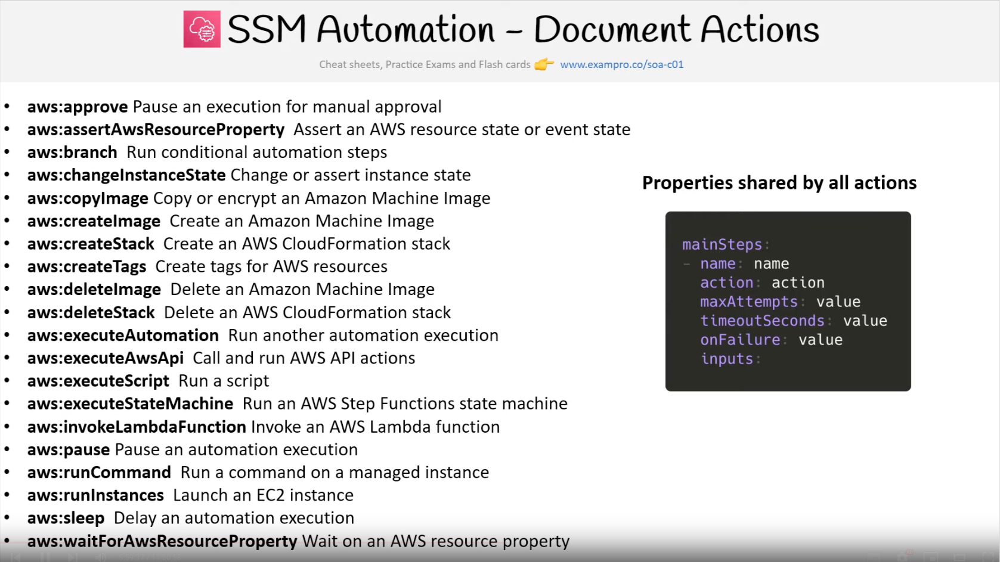

## Simple Systems Manager
Manage fleet of EC2s at scale. Get operational insights about the state of your infrastructure, easily detect problems. Free service. Uses agent - do not need opening SSH port.

* patching (security updates)
* supplying configurations to VMs
* running OS commands on Vms
* monitoring
* secure connections
* maintain a configured state of a VMs

To add instance to fleet manager:
1. Add IAM role to EC2: `AmazonEC2RoleforSSM` (old) and `AmazonSSMManagedInstanceCore` (new).
2. Install SSM Agent on instance (Amazon and some Ubuntu got pre-installed software).

### SSM Agent
Preinstalled on some AMIs (Amazon Linux 2, Ubuntu Server 18.04 up, Amazon ECS-Optimized). In other - manual installation.

### SSM Explorer
Customizable operational dashboard:
* OpsData - displays an aggregated view of operations data
* OpsItems - metadata about EC2 instances, patch compliance details
* widgets - the individual report boxes that show data, graphs or charts
* modes:
    * single-account/single-region (default)
    * single-account/multi-region
    * multi-account/multi-region
* report export to S3
* free service, but charges on the number of API calls

### SSM OpsCenter
Consolidation of operational work items (OpsItems). List of task, that must be done on instances. Similar to tickets - statuses (Open, InProgress, Resolved), priorities, similar and related Items.

Examples:
* EC2 instance disk full
* RDS instance not responding to ping
* EC2 instance terminated/stopped
* Autoscaling instance launch failed
* EBS snapshot copy failed

OpsItem (Operational work item) - work that needs to be performed on an EC2 instance (some problem to resolve):
* can be manually created
* can be triggered by AWS Config, CloudWatch Events, CloudWatch Application Insights

### SSM Remediation
Remediation is process of fixing OpsItem using Runbooks.\
`Runbook` - document that contains a series of instructional steps to perform an operation. Can describe regular maintenance, remediation due to misconfiguration or procedure to act with unexpected incident. Can be associated with SSM Automation Document.

### SSM Automation
Simplifies common maintenance and deployment tasks on AWS resources from outside of resource (command works from inside of resource).
Used to create: EBS snapshots, creating AMIs, restarting instances. Can be triggered manually, scheduled, by EventBridge or by AWS Config for rules remediations.

Example of AWS owned automation:
AWS-StopEC2InstanceWithApproval - one or more IAM users receives Approval request (by SNS topic) for stopping the instance.

#### Automation Documents (runbooks, operational playbooks)
Define a series of actions in JSON or YAML format (automation workflow). SSM Documents type: Automation.

#### Automation Action
Individual step in an automation document as part of workflow.

#### SSM Change Calendars/Maintenance window
Allows you to define when SSM Automations are allowed or not allowed to be executed by your team (ex: demo day).

### SSM - Documents
Definition of actions and parameters. Can be made in JSON or YAML.

### SSM AppConfig
Create, manage and quickly deploy application configuration.
Rollout changes functionality. Includes built-in validation checks and monitoring. Can be used with apps hosted on: Ec2, Lambda, containers, mobile apps etc.

* Environment - a group of AWS resources intended for the deployment
* Deployments - the act of deploying application configuration changes
    * configuration profile - where the config is located and how to validate it
    * configuration source - the location of (new) app configuration (S3, SSM Document, SSM parameter)
    * validators - will check if configuration is valid
* Deployment strategy:
    * deployment type: linear or exponential
    * deployment time: duration for this deployment
    * bake time - amount of time to wait before completing the deployment

### SSM Run Command
Execution of document (script) or run single command on multiple instances (resource groups). Integrated with IAM & CloudTrail. Output from console can be send into S3, SNS or CloudWatchLogs. Command can be invoked (run) using EventBridge.

Task types:
* install or bootstrap application
* execute script
* run a docker action
* run Ansible playbook or Chef recipe
* configure AWS packages (ex: CloudWatch agent)
* install Windows Update
* build a deployment pipeline
* capture log files when instance is terminated from ASG
* join Windows instances to domain

Rate control - how much instances will run script simultaneously or manual stop execution of command if X errors occurs.

### SSM Parameter Store
Securely store configuration and secrets in AWS. Optional encryption (KMS). Version tracking. Integration with CloudFormation and CloudWatch Events. Hierarchy of stored secrets - path in name eg. “/my-app/dev/db-pass”.

Pricing:
Standard - free. max 10k parameters (4KB). Pay only for high output of API.
Advanced - 0.05$ per parameter. Max 100k (8KB). Parameters policies.

 Policies - create TTL of parameters (passwords).

Parameters types:
* string
* string list
* secure string

Accessing parameters by CLI:
`aws ssm get-parameters —names /my-app/dev/db-pass /my-app/prod/db-url`

`—with-decryption`
will check if user got KSM keys and if yes, will return decrypted secret

`aws ssm get-parameters-by-path —path /my-app/dev --recursive`
will return all parameters from given path

### SSM State Manager
Automate the process of keeping your instances in state that you defined. Used for eg. updating/patching OS. Uses SSM Documents to create Association (eg. SSM document to configure CloudWatch Agent.

State Manager Association
* defines the state that you want to maintain, eg. port 22 must be closed
* specify a schedule when the configuration is applied

### SSM Inventory

Collect metadata form your managed instances (EC2/on-prem): installed software, OS drivers, configurations, updates, running services etc. Data can be viewed in AWS Console or stored in S3 to query and analyze by Athena and QuickSight. Collection interval can be set.

### SSM Activations
Allows ypu to register external resources (on=prem, non-Aws instances) to be managed by AWS Systems Manager. It creates Code and ID to set on resource.

### SSM Patch manager
Automates the process of patching OS (Linux,, macOS, Windows). Scan instances and generate patch compliance report.

Patch baseline - defines which patches should be installed (can be custom). Auto-approve within days of release. By default installs only critical/security patches.

Patch group - set of instances with specific Patch baseline (eg. environment: dev, prod). Use tag:  “Patch Group “.  Instance can be in only one Patch Group. Patch group can be registered with only one Patch baseline.

SSM Maintenance Window
* defines a schedule for when to perform actions on instances
* contains: schedule, duration, set of registered instances and tasks.

### SSM Session manager
Allows to SSH on EC2 and on-prem. Access through AWS Console, CLI or Session Manager SDK. Do not need SSH access, bastion host or keys (use agent). Can log connections (CloudWatch, S3). CloudTrail can listen sessions. Requires IAM permissions. Use tags for defining instances access. Even commands can be restricted.