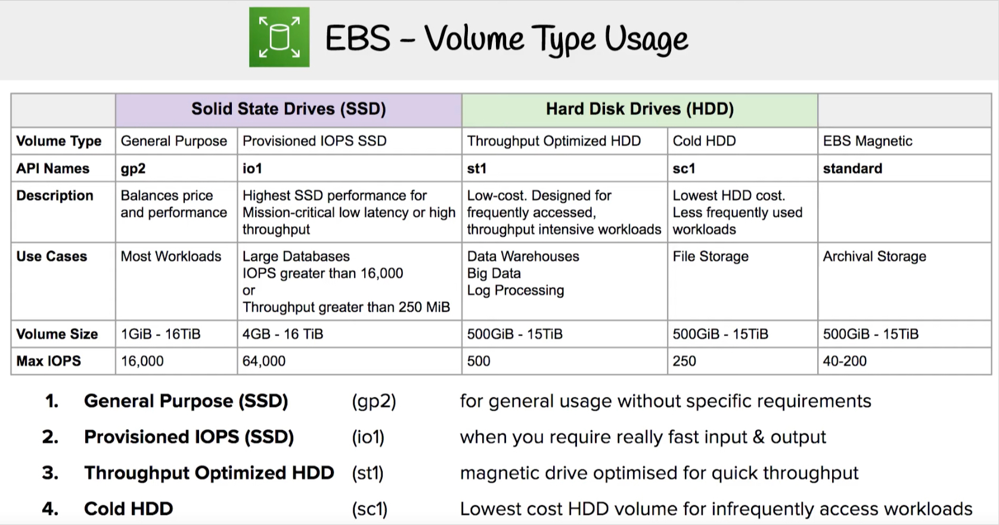

# Storage
Types of storage:
* Block - EBS, Instance Store
* File - EFS, FSx
* Object - S3, Glacier

>IOPS - Input/Output per second, amount of independent reads and writes can be performed on a storage medium.

>Throughput - data transfer rate to and from the storage in megabytes per second

>Bandwidth - the measurement of total possible speed of data movement along the network
```
bandwidth - pipe
throughput - water
```

## EBS
### EBS volumes types:
* General Purpose gp2/gp3 (SSD) - general purpose, can be root volume
* Provisioned IOPS io1/io2 (SSD) - highest performance SSD, for mission critical, low latency or high-throughput workloads, can be root volume
* Throughput Optimized st1 (HDD) - low cost HDD for frequently accessed, throughput intensive workloads, cannot be root volume
* Cold HDD sc1 (HDD) - lowest cost HDD for less frequently accessed workloads, cannot be root volume
* EBS Magnetic (standard) - obsolete generation of HDDs



### General Purpose
* GP2:
	* 1GB - 16TB
	* size of volume and IOPS are linked
	* small volumes max 3000 IOPS
	* max 16 000 IOPS at 5TB
* GP3:
	* 1GB - 16TB
	* baseline 3 000 IOPS and 125MiB/s
	* increase up to 16 000 IOPS and 1000 MiB/s (not linked)

### Provisioned IOPS SSD:
* critical business applications with permanent IOPS performance (databases eg. )
* supports EBS multi-attach
* io1/io2 (4GiB - 16TiB)
	* PIOPS independent from storage size
	* max 32 000 IOPS (64k for Nitro EC2)
	* io2 has more IOPS with the same price
* io2 Block Express (4GiB - 64 TiB)
	* max 256 000 IOPS
	* 1000 IOPS : 1GiB dependency
	* sub-milliseconds latency

EBS multi-attach - feature for some EBS. Volume can be attached to multiple instances in the same AZ simultaneously. Used for higher application availability in clustered Linux applications. Application must manage concurrent write operations (very specific eg. Teradata). Cluster-aware filesystem must be used (GFS, VMFS, Lustre).

### Hard Disk Volumes HDD
* cannot be a root volume
* 125 MiB to 16 TiB
* throughput optimized (st1)
	* max 500MiB/s and 500 IOPS
	* big data, data warehouse, log processing
* cold HDD (sc1)
	* infrequent data access
	* the lowest cost
	* max 250 MiB/s and 250 IOPS

### Resizing
Volume type can be changed.
Volume size cannot be decreased.
After increasing volume size partition must be repatriated - disk size will be increased, but partition will stay the same.

For root volumes:
```
sudo growpart [DISK_NAME] [PARTITION_NAME]
sudo growpart /dev/xvda 1
```

Other tools:
resize2fs
xfs_growfs

### Moving volumes
From one AZ to another:
* take a snapshot
* create AMI from the Snapshot
* launch new EC2 instance in desired AZ

From one Region to another:
* take a snapshot
* create AMI from the Snapshot
* copy AMI to another region
* launch new EC2 instance in desired region from copied AMI

### Snapshots

Amazon Data Lifecycle Manager - automate the creation, retention and deletion of EBS snapshots and EBS-backed AMIs. Schedule backups, cross-account snapshot copies, delete outdating backups. Uses resource tags.
Can only manage snapshots created by itself (no external).

Fast Snapshot Restore
Snapshots are stored in S3. There is a latency of I/O operations (pulling from S3) while restoration. To fast this process force the initialization of entire volume (using dd or fio) or enable FSR.

FSR - creates a volume from snapshot that is fully initalized at creation (no i/o latency). Expensive!

EBS Snapshots archive - move snapshots to an archive tier (75% cheaper, 24-72h to restore).

Snapshot Recycle bin - can be enabled (retention 1 ay to 1 year).

### Encryption of EBS
If volume is encrypted:
* data at rest is encrypted inside the volume
* all data in flight while moving between the instance and the volume is encrypted
* all snapshots are encrypted
* all volumes created form the snapshots are encrypted

Encryption of old volume:
* create the snapshot
* encrypt snapshot (copy it with encryption checked)
* create new volume from encrypted snapshot
* attach encrypted volume instead old one

## Elastic File System (EFS)

Managed NFS (v4.1) - POSIX file system.
Can be mounted on many EC2 in many AZ.
Highly available, expensive (3x gp2), pay per use.
Need Security group to access control. Encryption  at rest (KMS).
Scales automatically, pay per use, no capacity planning!
10 GB/s + throughput.

Performance mode (set at creation time)
* general purpose (default) - web servers, CMS, etc.
* max I/O - higher latency, throughput - big data, media processing

Throughput mode:
* bursting (1TB = 50 MiB/s + burst up to 100 MiB/s)
* provisioned - set your throughput regardless of storage size
(eg. 1GiB/s for 1TB)

Storage tiers:
* standard - for frequently accessed files
* infrequent access (EFS-IA) - lower price, but cost to retrieve files, can be enabled by Lifecycle Policy

Availability and durability:
* standard - regional (multi-AZ), for prod
* one zone - for dev, backup enabled by default, compatible with EFS-IA

EFS Access Points
Enforce a POSSIX user and group to use when accessing the file system.
Restrict access to a directory within the filesystem and optionally specify a different root directory. Can restrict access from NFS clients using IAM policies.

/
  /data
  /secret
  /config

Access point 1 for UID: 1001, GID 1001, path: /config
For developers users/groups `/config = /`

Access point 2 for UID: 1002, GID 1002, path: /data
For analytics users/groups `/data = /`

Operations
To change Performance mode (e.g. Max IO) or encrypt EFS AWS Data Sync must be used (replicates all file attributes and metadata).

CloudWatch metrics:
* PercentIOLimit - how close the filesystem reaching the I/O limit (GP), if at 100%, move it to Max I/O using DataSync
* BurstCreditBalance
* StorageBytes - 15min interval

## S3
S3 is regional scope, but bucket names must be globally unique.

### Versioning
* file uploaded before enabling versioning: version = null
* file uploaded after enabling versioning: version = [long_hash]
* file deleted with enabled versioning: versions still exists, S3 adds “delete marker” - version stamp that disable object visibility
* restore file deleted with versioning: delete “the delete marker”

### Encryption
* SSE-S3 - keys are fully handled and managed by AWS
	* Server Side Encryption
	* upload with HTTP header: “x-amz-server-side-encryption”:”AES256”
* SSE-KMS - keys are controlled by Key Management Service
	* KMS advantages: user control + audit trail
	* upload with HTTP header: “x-amz-server-side-encryption”:”aws:kms”
* SSE-C - keys are managed by user outside AWS
	* S3 doesn’t store encryption key
	* HTTPS must be used
	* encryption key must be provided in HTTP headers for every request
* CSE - client-side encryption - files are uploaded in encrypted version
	* library: Amazon S3 Encryption Client
	* S3 is storing only encrypted data - doesn’t provide any encryption/decryption operations

Encryption can be set on object level or for whole bucket - “Default encryption” option.

### S3 security
* user based
	* IAM policies - which API calls should be allowed for a specific user
* resource based
	* Bucket policies - allows cross account
	* Object ACL - read and write permissions at object level
	* Bucket ACL

Principal “*”  = public access

*S3 default encryption*
Prevent upload objects without encryption:
Properties - Default Encryption - Enable

Default encryption using bucket policy:
```
...
"Action" : "S3:PutObject",
"Effect" : "Deny",
"Condition": {
  "Null" : {
 		"s3:x-amzn-server-side-encryption" : "true"
  }
}

...
"Action" : "S3:PutObject",
"Effect" : "Deny",
"Condition": {
  "StringNotEquals" : {
 		"s3:x-amzn-server-side-encryption" : "AES256"
  }
}
```

*Blocking public access*

Options:
* Block all public access
* from new ACLs
* from any ACLs
* from new public bucket or access point policies
* from any public bucket or access point policies

Can be set to all buckets: “Account setting for block public access”.

*VPC endpoints* - for instances in VPC without internet access.

*S3 access logs* - can be stored in ANOTHER S3 bucket. Enabling both in the bucket same will create log loop.
API calls (authorized and denied) can be logged in AWS cloud trail.

*MFA delete* - can be required in versioned buckets to delete objects.
It forces user to generate code to do important operations on S3: permanently delete an object version, suspend versioning on the bucket.
Operations must be executed by CLI - AWS console will not work.

To enable this feature use CLI:
```
aws s3api put-bucket-versioning --bucket [BUCKET-NAME] --versioning-configuration Status=Enabled,MFADelete=Enabled --mfa "[MFA-DEVICE-ARN] [MFA-CODE]" --profile [PROFILEN-NAME]
```

To enable/disable this feature root account must be used.

*Pre-signed URLs*
Valid only for limited time, default 3600 seconds. Set by “—expires-in”.
Generation is made by SDK or CLI (downloads only).
Permissions are inherited from user who generated link.

Usage:
 * premium video service for logged in users,
 * ever changing list of users to download files by generating URLs dynamically
 * temporary allow user to upload a file to a precise location in our bucket

Download link can be generated from AWS Console:
Object actions - Share with pre-signed URL

### S3 Replication
* Cross Region Replication CRR - compliance, lower latency access, replication across accounts.
* Same Region Replication SRR - log aggregation, live replication between prod and test accounts.

Versioning must be enabled (both).
Copying is asynchronous. Version IDs are replicated.
Buckets can be in different accounts - must give a proper IAM permissions.
Only new objects are replicated, to replicate old and failed objects use S3 Batch Replication. Delete markers can be replicated (optional), deletion with version ID (permanent) are not replicated. No replication chaining.

Enabling: (origin bucket)
Management - Replication rules - Create
Will ask if replicate existing objects.

### S3 Inventory
List objects and their metadata - alternative to S3 List API operations.

Can generate daily or weekly repots in CSV, ORC or Apache Parquet.
Data can be queried using AWS Athena, Redshift and other.
Report can be filtered using S3 select.

Usage:
 * audit and report on the replication and encryption status
 * get the number of objects in your S3 bucket
 * identify the total storage of previous object versions

Enabling:
Bucket - Management - Inventory Configuration
Second bucket to store data must be select (in the same region).

### S3 Baseline performance

5 500 GET/HEAD requests per second per prefix
3 500 PUT/COPY/POST/DELETE requests per second per prefix

It’s good to spread files in more than 1 prefix to get higher read performance.

KMS limitations - 5 500, 10 000 or 30 000 quota (GenerateDataKey and Decrypt KMS API calls) per second, based on region, can be increased in Service Quotas.

### Multi-part upload:
* recommended for files > 100 MB
* obligatory for files > 5GB

Order is not important. It's speeding up transfers. Mac 10 000 parts. If some failures, only failed parts are re-uploaded. Lifecycle policy can be used to automate old parts deletion on unfinished upload. Upload can be done only using CLI or SDK. After all parts are uploaded, `Complete request` must be sent to pack parts together.


### S3 transfer acceleration
Use internal AWS network (EDGE locations), so only part of traffic is transferred using Internet. Compatible with multi-part upload.

S3 Byte-Range Fetches - GETs requests only part of file - resilience of download failures, can be used to retrieve only part of data.

### S3 Select & Glacier Select

Server side filtering (simple SQL statements) for download only needed files - cheaper and faster.

### S3 Event Notifications

Simple events can be managed form bucket settings or EventBridge association can be enabled:

event (put, delete…) —> S3 bucket —> EventBridge —- rules—-> 18 AWS destinations

Advanced filtering options with JSON rules (metadata, object size, name…)
Multiple destinations ex: StepFunctions, Kinesis Streams…
EventBridge Capabilities - Archive, Replay events, Reliable delivery

### S3 Lifecycle Rules

1. Transition actions - defines when objects are transitioned to another storage class, e: move to IA or Glacier.
2. Expiration Actions - configure objects to expire (delete) after some time, ex: logs.

Rules can be created for:
* certain prefix, ex: s3://mybucket/mp3/*
* certain objects tags, ex: Department: Finance

Analytics - setup will help determine when to transition objects from Standard to Standard IA. Report updated daily.

S3 bucket - Analytics - Add filter - Destination bucket select

## Glacier
Alternative to on-premise magnetic tape storage. Encrypted by default (AES-256), keys are managed by AWS.

S3:			Glacier:
Bucket		Vault
Object 		Archive

Max Archive size - 40TB.

Vault operations:
* Create & delete - delete only if empty
* Retrieving metadata - creation date, numer of archives, total size, etc.
* Download inventory - list of archives in the vault

Glacier operations:
* upload - single operation or by multiparts
* download - first initiate the retrieval job for the archive, then Glacier prepares it for download - user has a limited time to download the data from staging server (expiry time)
* delete - use Glacier REST API or AWS SDK by specifying archive ID

Retrieval options:
* expedited (1 to 5 mins) - $0.03 per GB
* standard (3 to 5h) - $0.01 per GB
* bulk (5 to 12h) - $0.0025 per GB

Vault policies - each vault has ONE policy for access and one for lock.
Policies are written in JSON.

Vault Access policy is like a bucket policy - restrict user/accounts permissions.

Vault lock policy is used for regulatory and compliance requirements.
Policy is immutable - it can never be changed, ex: forbid deleting an archive if less than 1 year old. Must be validated in 24h using LOCK ID, otherwise will be deleted.

WORM - write once, read many.

**Vault Notification Configuration:**
* configure a vault so, that when a job completes, a message is sent to SNS
* optionally, specify an SNS topic when you initiate a job

**S3 Event Notifications:**
* S3 supports the restoration of objects archived to S3 Glacier storage classes
* s3:ObjectRestore:Post => notify when object restoration initiated
* s3:ObjectRestore:Completed => notify when object restoration completed

### Athena

Serverless query service to perform analytics against S3 objects.
Use standard SQL, supports CSV, JSON, ORC, Avro and Parquet.
Pricing $5.00 per TB of scanned data. Query results location must be set (S3 bucket).

TIP: Use compressed or columnar data for cost-savings.

Use-cases:
* business intelligence
* analytics, reporting
* analyze VPC flow logs, ELB logs, CloudTrail etc.

1. Create database.
2. Use [specific query](https://aws.amazon.com/premiumsupport/knowledge-center/analyze-logs-athena/) to parse access logs.
3. Run Preview table to get parsed logs as table.

### S3 Access Points

For every directory inside bucket can be created a unique Access point. Access point has own DNS name and own access policy (access for specific IAM user/group). Traffic to AP can be restricted from specific VPC or internet access can be set.

If access to bucket have to be managed by access points only, control over bucket must be delegated - set bucket policy with condition that includes Access Point ID.

[Access Point Policy examples](https://docs.aws.amazon.com/AmazonS3/latest/userguide/access-points-policies.html)


### VPC Endpoint Gateway for S3

Used to access S3 bucket from EC2 instance in private subnet. No need to open S3 to Internet. More secure and cheeper.

S3 bucket policy by `AWS:SourceVpce` - one or more endpoints, or `AWS:SourceVpc` for all possible VPC endpoints. For public traffic: `AWS:SourceIP`.

### S3 Bucket Policies

Used for:
* grant public access to the bucket
* force objects to be encrypted at upload
* grant access to another account (cross account)

Optional conditions on:
* Public IP or Elastic IP (not Private)
* aws:PrincipalOrgID - can be used to restrict access to the bucket only for accounts that are inside given organization
* Source VPC or Source VPC Endpoint - only works with VPC endpoints
* CloudFront Origin Access Identity
* aws:MultiFactorAuthPresent - used for allowing access to the objects only if account is logged with MFA

### S3 Batch Operations

Perform operations at massive amount of existing S3 objects with a simple request:
* modify object metadata and properties
* copy objects between buckets
* replace object tag sets
* modify ACLs
* restore objects from Glacier
* invoke Lambda functions to perform custom action on each object

A job consist a list of objects, the action to perform and operational parameters. S3 Batch Operations manages retries, tracks progress, sends completion notifications, generate reports, etc. S3 Inventory can be used to get object list and use S3 Select to filter your object before passing them to Batch Operations.

Cost: around $0.25

Manifest - a way to reference your files in your bucket to tell process which of files should be processed. S3 inventory report can be used or simple CSV file wit columns: bucket name, object_key and optionally version_id.

## Snow Family
High-secure, portable devices to collect and process data at the edge and migrate data into and out of AWS. If you need more than week to transfer data, use Snow family devices.

1. Snowcone (szyszka) - NUC PC, 8TB, online (DataSync agent) and offline, 2 CPU and 4GB RAM. AWS DataSync compatible. Data migration and edge computing.

2. Snowball Edge (kula śnieżna) - suitcase PC for TBs and PBs of data, up to 15 in cluster. Data migration and edge computing. Block or S3-compatible object storage. Long-term deployment options (1 or 3 years).

    * Storage Optimized 80TB block and S3, 40 vCPU, 80GB RAM
    * Compute Optimized 42 TB block and S3, 52 vCPU, 208 GB RAM, optional GPU, can run EC2 instances and Lambda functions (AWS IoT Greengrass)

3. Snowmobile (ciężarówka) - Exabytes of data, 100 PB of capacity per truck. To transfer more than 10 PB of data. Only data migration.
ś
4. OpsHUB - desktop software to manage SnowFamily

>Data from Snow devices cannot be copied to the Glacier directly, it's must be copied to S3  bucket and moved to glacier using lifecycle policy.

## FSx

3rd party managed filesystems:

1. FSx for Windows File Server (Windows native: SMB and NTFS), ACLs, user quotas, integrated with AD, single AZ (1 and 2 gen) or multi AZ (automatic failover), can be accessed from on-premise (VPS, DirectConnect).
    * SSD - latency sensitive (for DBs, media processing, data analytics)
    ś* HDD - broad spectrum of workloads (home dir, CMS)

2. FSx for Lustre (Linux + cluster) - distributed filesystem for high performance computing (ML, video processing, analytics), extremely fast. Integration with S3. Integration with on-premise servers.
    * SSD - low latency, IOPS intensive workloads, small and random file operations
    * HDD - throughput intensive workloads, large and sequential file operations

    Types:
    * Scratch File System - temporary storage, data is not replicated, high burst (6x faster, 200 MBps per TB). For short term processing

    * Persistent File System - long-term storage, data is replicated in the same AZ, usage: long-term processing, sensitive data.

3. FSx for NetApp ONTAP

## Storage Gateway
Extending, backing up on-prem storage to the cloud.
Connects on-prem software appliance with cloud-based storage.

Bridge between S3 object data and on-premise (hybrid solution) used for integration on-prem and cloud data. Local cache of cloud data on own infrastructure for most frequently used data. Software works in on-prem VM (ESXi, Hyper-V, KVM or EC2). Hardware appliance can be used.

Types:
* File Gateway - configured S3 bucket are accessible using NFS or SMB. Treat S3 like a local hard drive. Posix compliant. Classes: Standard, IA, One Zone IA. Access using IAM roles and AD integration. Local cache of Amazon S3 on own infrastructure for most frequently used data. Can be mounted on many servers.
* Volume Gateway - block storage using iSCSI protocol backed by S3. It gives you power of EBS locally - use your local drives as EBS drives.\
EBS Snapshots of your HDDs:
    * Cached volumes (1-32GB) - low latency access to most recent data - S3 is primary data storage, while retaining frequently accessed data locally in your Storage Gateway.
    * Stored volumes (1GB-16TB) - on-prem data with scheduled off-site backups stored in S3. Primary data is stored locally, while asynchronous backing up that data to AWS.
* Tape Gateway (VTL) - cost effective solution to archive your data in the cloud. Back up data using existing tape-based backup application (and iSCSI interface). Virtual Tape Library is backed by S3 and Glacier. Virtual tape cartridges.
* FSx File Gateway - native access to Amazon FSx for Windows File Server. Local cache to frequently accessed data. Useful for group file shares and home directories.

Rebooting Storage Gateway:
* File Gateway - simply restart the VM
* Volume and Tape Gateway - Stop "Storage Gateway Service" using AWS console or API, reboot the VM, start service

Storage Gateway Activation
* using the Gateway VM CLI
* making a web request to the Gateway VM on port 80 (must be opened)
(be sure, that Gateway VM has correct NTP time synchronization set)

Volume Gateway Cache efficiency:
* CacheHitPercent metric must be high
* CachePercentUsed must be low

## DataSync
Move large amount of data from on-prem to AWS (migration).\
Can synchronize to: S3 (any storage classes), EFS, FSx.\
Can synchronize from NAS or filesystems using NFS and SMB.\
Synchronization EFS - EFS between 2 regions or to encrypted volume.\
Tasks can be scheduled hourly, daily or weekly (not continuous!).\
DataSync agent must be used (TLS).\
Optional bandwidth limit. Incremental replication.

## AWS Backup
Centrally manage backups and automate backups across AWS services.\
Point in time recovery for some services (Aurora).\
Cross regions, cross accounts backup (Organizations).
On-demand and scheduled backups. Tag based backups.

Backup plans (policies):
* frequency (every 12h, daily, weekly,cron expression)
* backup window
* transition to cold storage
* retention period

Backup Vault Lock:
* enforce a WORM state for all the backups that you store in the vault.
* even root user cannot delete the backups
* protect from short retention period or malicious software