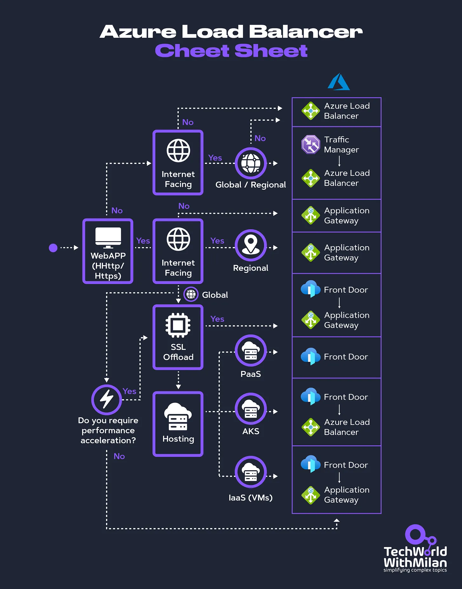

# Load-balancing options in Azure

It is crucial to ensure that applications can handle high traffic and always remain available. Load balancing is an important strategy for achieving this, and Azure offers several robust load-balancing solutions tailored to different needs.

Understanding Azure's load-balancing options can help you design scalable and resilient architectures, whether you're developing a simple cloud application or a complex system.

## Key Azure Services for load balancing

* `Azure Front Door`: A global load balancer that provides application acceleration and global load balancing at Layer 7 (HTTP/HTTPS). It optimizes routing based on performance and can handle SSL offloading.

* `Azure Traffic Manager`: A DNS-based traffic load balancer that distributes traffic across multiple regions. It supports various routing methods such as geographic, performance, and priority-based routing, ensuring users are directed to the most appropriate regional endpoint.

* `Azure Load Balancer`: A Layer 4 load balancer distributes traffic across a region's virtual machines (VMs). It supports both inbound and outbound scenarios, providing high availability and low latency for regional deployments.

* `Azure Application Gateway`: is a Layer 7 load balancer with advanced routing capabilities, SSL termination, and a Web Application Firewall (WAF). It's tailored for web applications requiring regional load balancing.

## Dimensions

Azure load-balancing services can be categorized along two dimensions: global versus regional and HTTP(S) versus non-HTTP(S).
Global vs Regional Load Balancing

### Global Load Balancing 🌍

Is designed to distribute traffic across multiple regions, enhancing availability, performance, and redundancy. It ensures that users are directed to the nearest or most optimal regional deployment, minimizing latency and improving user experience.

Services to use: Azure Front Door or Azure Traffic Manager.

➡️ Use cases:

* Applications with users spread across multiple geographic regions.

* Scenarios require disaster recovery and failover capabilities.

* Improving application performance by reducing latency through regional routing.

### Regional Load Balancing 📍

Focuses on distributing traffic within a specific Azure region. It's ideal for scenarios where the application is hosted in a single region or when managing traffic across multiple services within that region.

Services to use: Azure Load Balancer or Azure Application Gateway.

➡️ Use cases:

* Internal applications within a virtual network.

* Web applications with advanced routing needs are hosted within a single region.

* Load balancing across services within the same region for high availability.

## HTTP(S) vs. Non-HTTP(S) Load Balancing

### HTTP(S) Load Balancing 🔒

Operates at Layer 7 and is designed to handle web traffic. It provides advanced routing capabilities based on URL paths, host headers, and more. These services are optimized for web applications, offering features like SSL offloading and web application firewalls.

Services to use: Azure Front Door or Azure Application Gateway.

➡️ Use cases:

* Web applications requiring complex routing rules.

* Securing web traffic with SSL/TLS and WAF.

* Optimizing web application performance through caching and compression.

### Non-HTTP(S) Load Balancing

Operates at Layer 4 and is used for general-purpose traffic, such as TCP and UDP. These services are suitable for scenarios where low-level network traffic management is required.

Services to use: Azure Load Balancer or Azure Traffic Manager.

➡️ Use cases:

* Applications requiring low-level traffic management, such as database servers or file transfers.

* Non-web applications that use TCP or UDP protocols.

* Balancing load for backend services and internal applications.

When you try to create a load balancer in Azure, you will be guided through a decision tree.

