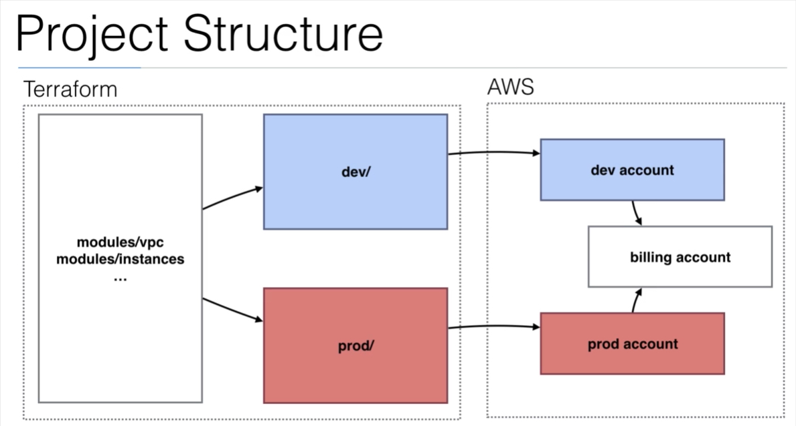

## Links:
https://learn.hashicorp.com/terraform?utm_source=terraform_io\
https://learn.hashicorp.com/collections/terraform/cli\
https://learn.hashicorp.com/collections/terraform/configuration-language\
https://learn.hashicorp.com/tutorials/terraform/resource?in=terraform/configuration-language\
https://blog.gruntwork.io/terraform-tips-tricks-loops-if-statements-and-gotchas-f739bbae55f9\
Using maps:
https://www.youtube.com/watch?v=UFEhJFIj9gY

## Infrastructure as a Cloud (IaaC) in Terraform:
* infrastructure can be deployed on multiple cloud providers
* human readable configuration
* state allows to track changes in infrastructure
* configuration can be managed using version control

Terraform plugins to manage different cloud operators are called providers.
Resources are individual units of infrastructure (VMs, private networks etc.).
Terraform configurations are called modules.
Configuration language is declarative - describes desired state of resource.
Providers calculate dependencies between resources and create or destroy needed.

>Scope       - identify the infrastructure for your project\
>Author      - write the config\
>Initialize  - installing plugins\
>Plan        - preview the changes\
>Apply       - make the planned changes

Terraform keeps state of infrastructure in state file. This file is used to determine changes to do.
- - - - - - - - - - - - - - - - - - - - - - - - - - - - - - -
## Installation

Installation in Ubuntu:
```
sudo apt-get update && sudo apt-get install -y gnupg software-properties-common curl
curl -fsSL https://apt.releases.hashicorp.com/gpg | sudo apt-key add -
sudo apt-add-repository "deb [arch=amd64] https://apt.releases.hashicorp.com $(lsb_release -cs) main"
sudo apt-get update && sudo apt-get install terraform

terraform -install-autocomplete
```

Installation in MacOS:
```
brew tap hashicorp/tap
brew install hashicorp/tap/terraform
```
- - - - - - - - - - - - - - - - - - - - - - - - - - - - - - -
## Using AWS stored credentials:
```
provider "aws" {
  access_key = "ACCESS_KEY_HERE"
  secret_key = "SECRET_KEY_HERE"
  region = "us-east-1"
}
```
### Profiles
```
~/.aws/credentials
[default]
aws_access_key_id = AKIAWAXFM....YFOGXOZ
aws_secret_access_key = ...
```
To work with multiple profiles change profile name to default and add next profile below.
To set current profile to use:
```
export AWS_PROFILE=lukcic
```

- - - - - - - - - - - - - - - - - - - - - - - - - - - - - - -

## Terraform Commands

### Check

* terraform init
  * initialize the project, which downloads a plugins

* terraform fmt
  * format tf file

* terraform validate
  * check and correct syntax of terraform file

### Plan

* terraform plan
  * will show the changes that will be applied on infrastructure

* terraform plan -out=[filename.plan]
  * will output plan to file

### Apply

* terraform apply
  * apply planned changes

* terraform apply [filename.plan]
  * apply changes saved in tf plan file

* terraform apply -targed aws_instance.name.id ???
  * will apply only given resource

* terraform apply -auto-approve
  * will skip the confirmation

* terraform apply -var-file example.tfvars
  * apply changes with overriding variable file

* terraform apply -var "instance_name=myOwnName"
  * apply changes with overriding variable

* terraform show
  * inspect created resources - human readable

* terraform output [NAME]
  * returns values of output variables saved in configuration

* terraform destroy
  * destroy the resources created in this apply

* terraform destroy -target aws_instance.name.id
  * will destroy only given resource


### State

* terraform state
  * advance state management (rename the resource etc.)

* terraform state list
  * show only resources names stored in state

* terraform state mv [OLDNAME] [NEWNAME]
  * rename resources in state after rename in config file
  * used to move resources from root module to own modules:
    * terraform state mv aws_key_pair.arb-prod-key-rsa module.ec2.aws_key_pair.arb-prod-key-rsa
    * terraform state mv aws_vpc.arb-prod module.network.aws_vpc.arb-prod

* terraform refresh
  * refresh the remote state

* terraform remote
  * configure remote state storage

* terraform console
  * enable TF console

* terraform get
  * download and update modules

* terraform graph
  * create visual representation of a configuration or execution plan

* terraform import [OPTIONS] [NAME] [id]
  * import state of existing resource to Terraform state

* terraform taint [NAME]
  * manually mark a resource as tainted (will be destructed and recreated at the next apply)

* terraform untaint [NAME]
  * undo a taint

### Lockfile
Lockfile stores version of provider, so with next download,\
TF will not download latest version of provider, but version saved in Lockfile.\
This file is created during terraform init and should be stored in version control.

- - - - - - - - - - - - - - - - - - - - - - - - - - - - - - -
## First module

main.tf:
```
terraform {
  required_providers {
    docker = {
      source  = "kreuzwerker/docker"
      version = "~> 2.15.0"
    }
  }
}

provider "docker" {}

resource "docker_image" "nginx" {
  name         = "nginx:latest"
  keep_locally = false
}

resource "docker_container" "nginx" {
  image = docker_image.nginx.latest
  name  = "tutorial"
  ports {
    internal = 80
    external = 8000
  }
}
```

- - - - - - - - - - - - - - - - - - - - - - - - - - - - - - -
## Terraform registry:
Here are definitions of terraform providers

[https://registry.terraform.io]()

- - - - - - - - - - - - - - - - - - - - - - - - - - - - - - -

## Terraform state
Has sensitive data, so should be managed as a secret!

* terraform.tfstate           - in this file terraform stores state of created infrastructure.
* terraform.tfstate.backup    - backup of the previous state

Commands:
```
terraform state                       # advanced state management
terraform state list                  # list resources handle by state file
terraform state show [resource_name]  # will show detailed information about resource
terraform force-unlock [LOCK_ID]      # will delete lock
```

### Remote state

```
terraform {
  required_providers {
    aws = {
      source  = "hashicorp/aws"
      version = "4.14.0"
    }
  }

  backend "s3" {
    bucket          = "globally_unique_bucket_name"
    key             = "filename.tfstate"
    region          = "eu-central-1"
    dynamodb_table  = "dynamodb_table_name"
    encrypt         = true
  }
}

provider "aws" {
  region  = var.region
  profile = var.profile
}
```
- - - - - - - - - - - - - - - - - - - - - - - - - - - - - - -

## Outputs

```
resource "aws_instance" "example" {
  ami           = var.AMIS[var.AWS_REGION]
  instance_type = "t2.micro"
}

output "ip" {
  value = aws_instance.example.public_ip
}
```

### Using attributes locally
```
resource "aws_instance" "example" {
  ami           = var.AMIS[var.AWS_REGION]
  instance_type = "t2.micro"

  provisioner "local-exec" {
    command = "echo ${aws_instance.example.private_ip} >> private_ips.txt"
  }
}

```
- - - - - - - - - - - - - - - - - - - - - - - - - - - - - - -
## Data-sources

Examples:
* list of AMIs
* list of AZs
* all IP addresses use by AWS

Opening SG for incoming traffic from European AWS IP ranges:
```
data "aws_ip_ranges" "european_ec2" {
  regions = [ "eu-west-1", "eu-central-1" ]
  services = [ "ec2" ]
}

resource "aws_security_group" "from_europe" {
  name = "from_europe"

  ingress {
    from_port = "443"
    to_port = "443"
    protocol = "tcp"
    cidr_blocks = [ "${data.aws_ip_ranges.european_ec2.cidr_blocks}" ]
  }

  tags {
    CreateDate = "${data.aws_ip_ranges.european_ec2.create_date}"
    SyncToken = "${data.aws_ip_ranges.european_ec2.sync_token}"
  }

}
```

- - - - - - - - - - - - - - - - - - - - - - - - - - - - - - -
## Templates

The template provider helps creating customized configuration files.\
You can build templates based on variables from terraform resource attributes (ex: public IP address).\
Can be used to create generic templates (user data) or cloud init configs.

Template file:
```
#!/bin/bash
echo "database-ip = ${myip}" >> /etc/myapp.config
```

Use the my-template resource when creating a new instance
```
resource "aws_instance" "web" {
  # ...
  user_data = templatefile("templates/init.tpl", {
    myip = aws_instance.database1.private_ip
  })
}
```

Another way:
```
locals {
  web_vars = {
    myip = aws_instance.database1.private_ip
  }
}

resource "aws_instance" "web" {
  # ...
  user_data = templatefile("templates/init.tpl", local.web_vars)
}
```

- - - - - - - - - - - - - - - - - - - - - - - - - - - - - - -
## Modules
Code that creates particular tasks can be written as module.
Modules can be reused - need to pass arguments to the module.
This code can be written once and used in many projects.



External modules - written by others
Internal modules - used ex: for dividing code for different AWS regions

We wrote module once and use it in many providers (AWS in multiple regions).
Arguments can be sent to back to main code using outputs.

module.NAME.output\
`${module.aws_vpc.vpcid}`

Module for deploying Consul cluster:
```
module "consul" {
  source   = "github.com/wardviaene/terraform-consul-module.git?ref=terraform-0.12"
  key_name = aws_key_pair.mykey.key_name
  key_path = var.PATH_TO_PRIVATE_KEY
  region   = var.AWS_REGION
  vpc_id   = aws_default_vpc.default.id
  subnets = {
    "0" = aws_default_subnet.default_az1.id
    "1" = aws_default_subnet.default_az2.id
    "2" = aws_default_subnet.default_az3.id
  }
}

output "consul-output" {
  value = module.consul.server_address
}
```

Networking:
```
# default VPC
resource "aws_default_vpc" "default" {
  tags = {
    Name = "Default VPC"
  }
}

# default subnets
resource "aws_default_subnet" "default_az1" {
  availability_zone = "${var.AWS_REGION}a"

  tags = {
    Name = "Default subnet for ${var.AWS_REGION}a"
  }
}

resource "aws_default_subnet" "default_az2" {
  availability_zone = "${var.AWS_REGION}b"

  tags = {
    Name = "Default subnet for ${var.AWS_REGION}b"
  }
}

resource "aws_default_subnet" "default_az3" {
  availability_zone = "${var.AWS_REGION}c"

  tags = {
    Name = "Default subnet for ${var.AWS_REGION}c"
  }
}
```


- - - - - - - - - - - - - - - - - - - - - - - - - - - - - - -
## Importing resources

1. Define provider and credentials.
2. Create S3 bucket and DynamoDB to handle state.
3. Create IAM policy to access state resources.
4. Create resource name:

```
resource "aws_instance" "bastion" {

}

```
5. Import instance:
`terraform import aws_instance.bastion i-12345678`

6. Check the imported resource configuration:
`terraform state show [TYPE].[NAME] -no-color > show`

7. Copy resource configuration to the file.
8. Cleanup, create references.
9. Terraform plan - should be no changes.

- - - - - - - - - - - - - - - - - - - - - - - - - - - - - - -

## Workspaces:

Terraform workspaces allow you to store your Terraform state in multiple, separate, named workspaces.
Terraform starts with a single workspace called “default” and if you never explicitly specify a workspace, then the default workspace is the one you’ll use the entire time.

`terraform workspace list`                      # will show all workspaces\
`terraform workspace show`                      # show current workspace\
`terraform workspace new [NEW_WORKSPACE_NAME]`  # create new workspace\
`terraform workspace select default`            # will change workspace to default\

Switching to a different workspace is equivalent to changing the path where your state file is stored.

```
resource "aws_instance" "example" {
  ami           = "ami-0c55b159cbfafe1f0"
  instance_type = (
    terraform.workspace == "default"    # for default workspace terraform will create t2.medium instance, for other workspaces will create t2.micro
    ? "t2.medium"
    : "t2.micro"
  )
}
```
- - - - - - - - - - - - - - - - - - - - - - - - - - - - - - -

