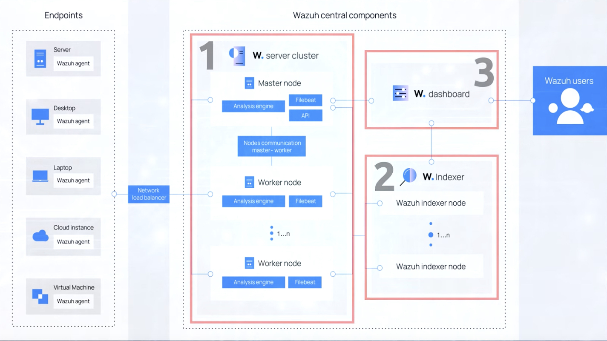

# Wazuh

SIEM - Security Information and Event Management

## Architecture



## Installation in ubuntu

```sh
curl -sO https://packages.wazuh.com/4.8/wazuh-install.sh
bash wazuh-install.sh -a
```

Will output admin's credentials at the end.

`wazuh-install-files.tar` - files with API pasword, certificates ets. With multi node install they must be distributed
into nodes.

### Agent installation

https://documentation.wazuh.com/current/installation-guide/wazuh-agent/wazuh-agent-package-linux.html

Agent config file:
`/var/ossec/etc/ossec.conf`
